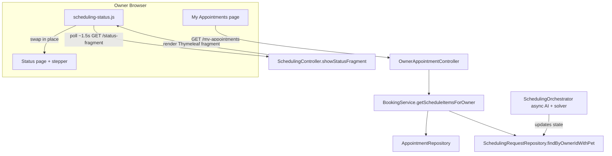

# Requirements

### Overview & Goals
Improve the owner-facing UX of the AI-assisted appointment scheduling flow in two ways:

1. **Visibility** — Every scheduling request an owner starts should be visible and reachable from the **My Appointments** page, together with confirmed appointments, each showing a clear status. Today `My Appointments` only lists confirmed `BOOKED` appointments; an in-progress request is reachable only via its status URL, so owners who navigate away lose track of it.
2. **Live submit progress** — When a request is submitted, the two asynchronous operations (AI interpretation, then the constraint solver) should be reflected as a live **two-step progress stepper** that advances in place as each operation completes, replacing today's jarring full-page `<meta http-equiv="refresh">` reload.

### Scope
**In scope**
- Unified **My Appointments** view listing confirmed upcoming appointments **and** the owner's scheduling requests, each with a status badge and a working link.
- Include all active (non-terminal) requests plus recently closed requests (cancelled/expired/rejected) for short-term history.
- Redesigned status page with a two-step stepper (AI → solver) that updates in place via HTML-fragment polling.

**Out of scope**
- Staff-facing views (`/staff/**`), the staff queue, and direct booking.
- Changing the underlying state machine, solver, or AI integration.
- Introducing a JSON/REST API or SPA (project rule: server-rendered Thymeleaf only).
- Notifications (email/SMS/push).

### User Stories
- As an **owner**, I want every appointment request I start to appear in **My Appointments** with its current status, so I can find and resume it without a bookmarked URL.
- As an **owner**, I want to see recently closed requests (cancelled/expired/rejected) for a short window, so I understand what happened to past attempts.
- As an **owner**, after I submit a request I want to watch it progress through "understanding my request" and "finding a time slot" and have the page advance automatically, so I know the system is working and what stage it is at.

### Functional Requirements
- **FR-1** `My Appointments` shows a single ordered list mixing scheduling requests and confirmed appointments.
- **FR-2** Each row shows an owner-friendly status label with a color-coded badge (e.g. *Analyzing request*, *Needs your confirmation*, *Finding a slot*, *Slot offered*, *With clinic staff*, *Booked*, *Cancelled*).
- **FR-3** Request rows link to the existing status page (`/scheduling/requests/{id}`); appointment rows keep their existing *Details* link.
- **FR-4** Active requests offer a *Cancel request* action (reusing `POST /scheduling/requests/{id}/cancel`); `BOOKED` appointments keep *Cancel*.
- **FR-5** `CONFIRMED` requests are not shown as separate rows (they are represented by their resulting appointment) to avoid duplicates.
- **FR-6** The status page shows a two-step stepper: Step 1 *Understanding your request* (AI/`INTERPRETING`), Step 2 *Finding a time slot* (solver/`SUGGESTING`); each step is pending / active (animated) / complete based on `request.state`.
- **FR-7** While the request is in `INTERPRETING` or `SUGGESTING`, the status region refreshes in place (no full-page reload) and advances to the next step/screen automatically when the state changes.
- **FR-8** Polling stops once an action or terminal state is reached (`AWAITING_CONFIRMATION`, `SLOT_HELD`, `CONFIRMED`, `STAFF_QUEUED`, `CANCELLED`, `EXPIRED`, `REJECTED`).

### Non-Functional Requirements
- **NFR-1 (Architecture fit)** No JSON/REST API or SPA — live updates use a server-rendered Thymeleaf **HTML fragment** endpoint polled by a small script.
- **NFR-2 (Graceful degradation)** With JavaScript disabled, a `<noscript>` meta-refresh keeps the flow functional.
- **NFR-3 (Access control)** All new/updated endpoints preserve existing ownership checks (`checkRequestOwnership`, owner resolution) and role guards.
- **NFR-4 (Lazy loading)** With `spring.jpa.open-in-view=false`, associations used in views must be fetch-joined to avoid `LazyInitializationException`.

# Technical Design

### Current Implementation
- **Owner appointments**: `OwnerAppointmentController.listMyAppointments` (`GET /my-appointments`) calls `BookingService.getUpcomingAppointmentsForOwner(ownerId)` → only `BOOKED` future `Appointment`s → rendered by `templates/scheduling/myAppointments.html`. In-progress `SchedulingRequest`s never appear here. `SchedulingRequestRepository.findByOwnerId(...)` already exists but is unused for owners.
- **Status page**: `SchedulingController.showStatus` (`GET /scheduling/requests/{requestId}`) loads `request`, `owner`, `pet`, `interpretation`, `heldSlot`, `appointment` and renders `templates/scheduling/status.html`. That template advances the flow with a full-page `<meta http-equiv="refresh" content="2">` while `INTERPRETING`/`SUGGESTING`.
- **State machine**: `RequestState` = `DRAFT → INTERPRETING → AWAITING_CONFIRMATION → SUGGESTING ⇄ SLOT_HELD → CONFIRMED`, plus `STAFF_QUEUED` and terminal `CANCELLED/EXPIRED/REJECTED` (`isTerminal()`). Async work is driven by `SchedulingOrchestrator.processInterpretationAsync` (AI) and `processSolveAsync` (solver).
- **Constraint**: `spec/rules.md` mandates *"only server-rendered Thymeleaf pages… No REST/JSON API, no SPA."*

### Key Decisions
- **KD-1 Unified list** *(confirmed)* — A single table on `My Appointments` mixes requests and appointments, each with a status badge; not two separate pages.
- **KD-2 List contents** *(confirmed)* — Show all non-terminal requests + recently closed requests (cancelled/expired/rejected within a recent window, e.g. 14 days) + confirmed upcoming appointments; skip `CONFIRMED` request rows (shown as appointments).
- **KD-3 Two-step stepper** *(confirmed)* — Represent the AI and solver stages as a 2-step progress stepper on the status page.
- **KD-4 HTML-fragment polling** *(confirmed)* — A new endpoint returns a rendered Thymeleaf **fragment** (HTML, not JSON) that a small script polls (~1.5s) and swaps in place, keeping the app server-rendered per `spec/rules.md`. Rejected: JSON+JS and SSE (both deviate from the no-API rule); rejected improved meta-refresh (still flickers).
- **KD-5 View model** — Introduce an `OwnerScheduleItem` DTO to normalize `Appointment` and `SchedulingRequest` into one row shape (label, badge class, links, sort key) so the template stays simple.

### Proposed Changes
**Appointments visibility**
- Add fetch-join `findByOwnerIdWithPet(Integer ownerId)` to `SchedulingRequestRepository` (mirroring the existing `findByStateWithOwnerAndPet`) so `pet` loads with `open-in-view=false`.
- Add `BookingService.getScheduleItemsForOwner(Integer ownerId)` that merges upcoming `BOOKED` appointments with the owner's requests (filtered per KD-2), maps each into `OwnerScheduleItem`, and orders: actionable/active first, then upcoming appointments by start time, then recently closed.
- Update `OwnerAppointmentController.listMyAppointments` to add `scheduleItems` to the model.
- Rewrite `myAppointments.html` to render the unified list.

**Live status stepper**
- Refactor `status.html`: wrap the dynamic body in a named fragment `th:fragment="statusContent"`; add the two-step stepper; remove `<meta refresh>`; add a `<noscript>` meta-refresh fallback.
- Add `GET /scheduling/requests/{requestId}/status-fragment` to `SchedulingController` returning `scheduling/status :: statusContent` with the same model attributes and the same `checkRequestOwnership` guard.
- Add `static/resources/js/scheduling-status.js` that polls the fragment endpoint while busy, swaps the container's HTML, animates step completion, stops on action/terminal states, and backs off on errors.

### Data Models / Contracts
```java
// New DTO in the scheduling package (record)
public record OwnerScheduleItem(
    Kind kind,              // REQUEST | APPOINTMENT
    Integer id,
    String petName,
    String vetOrSummary,    // vet name for appointments, request summary/rawText otherwise
    LocalDateTime when,     // appointment start time, or null for pre-scheduling requests
    String statusLabel,     // owner-friendly label
    String badgeClass,      // e.g. "bg-info", "bg-warning", "bg-success"
    boolean actionable,     // needs owner action (AWAITING_CONFIRMATION, SLOT_HELD)
    String detailUrl,       // /scheduling/requests/{id} or /my-appointments/{id}
    String cancelUrl        // nullable
) { enum Kind { REQUEST, APPOINTMENT } }

// New controller mapping
@GetMapping("/scheduling/requests/{requestId}/status-fragment")
String showStatusFragment(@PathVariable int requestId, Authentication auth, Model model);
// returns "scheduling/status :: statusContent"
```
Owner-facing status label / badge mapping (illustrative):

| State | Label | Badge |
|-------|-------|-------|
| INTERPRETING | Analyzing request | bg-info |
| AWAITING_CONFIRMATION | Needs your confirmation | bg-warning |
| SUGGESTING | Finding a slot | bg-info |
| SLOT_HELD | Slot offered — respond | bg-primary |
| STAFF_QUEUED | With clinic staff | bg-secondary |
| Appointment BOOKED | Booked | bg-success |
| CANCELLED/EXPIRED/REJECTED | Cancelled/Expired/Closed | bg-dark/secondary |

### Components
- **`myAppointments.html`** *(modified)* — unified table driven by `scheduleItems`, status badge column, per-row actions, empty state; keeps existing flash/error alerts.
- **`status.html`** *(modified)* — `statusContent` fragment + two-step stepper; existing per-state cards (confirm, held slot, confirmed, staff-queued, terminal) move inside the fragment so they render on both full page and fragment.
- **`scheduling-status.js`** *(new)* — fragment polling + stepper transitions + graceful fallback.
- **`OwnerScheduleItem`** *(new DTO)*, **`BookingService`**, **`OwnerAppointmentController`**, **`SchedulingController`**, **`SchedulingRequestRepository`** *(modified)*.

### File Structure
```
src/main/java/.../scheduling/
  OwnerScheduleItem.java            (new)
  BookingService.java               (modified: getScheduleItemsForOwner)
  OwnerAppointmentController.java    (modified: pass scheduleItems)
  SchedulingController.java          (modified: status-fragment endpoint)
  model/SchedulingRequestRepository.java (modified: findByOwnerIdWithPet)
src/main/resources/templates/scheduling/
  myAppointments.html                (modified: unified list)
  status.html                        (modified: fragment + stepper)
src/main/resources/static/resources/js/
  scheduling-status.js               (new)
```

### Architecture Diagram


### Risks
- **R-1 State/async race** — polling reads request state while `@Async` work writes it; mitigated by the existing transactional state writes and by rendering every state to a defined screen (already required by AC-16).
- **R-2 Fragment/full-page divergence** — moving per-state cards into a shared fragment must keep the full-page render identical; mitigate by rendering the fragment inside the full page rather than duplicating markup.
- **R-3 Lazy init** — `findByOwnerId` does not fetch `pet`; use the fetch-join variant to avoid `LazyInitializationException`.
- **R-4 History window duplication** — ensure `CONFIRMED` requests are excluded so they don't duplicate their appointment row.

# Testing

### Validation Approach
Extend the existing `@WebMvcTest`/`@SpringBootTest`-style controller and service tests already present for this module (`OwnerAppointmentControllerTests`, `SchedulingControllerTests`, `BookingServiceTests`). Verify behavior at the service level (list assembly) and controller level (model attributes, fragment rendering, access control), plus run the full build.

### Key Scenarios
- **Unified list assembly** — `BookingService.getScheduleItemsForOwner` returns confirmed upcoming appointments + non-terminal requests + recently closed requests, correctly ordered, with `CONFIRMED` requests excluded (extend `BookingServiceTests`).
- **My Appointments rendering** — `GET /my-appointments` places `scheduleItems` in the model and the page shows both a request row (with status badge + link to `/scheduling/requests/{id}`) and an appointment row (extend `OwnerAppointmentControllerTests`).
- **Status fragment endpoint** — `GET /scheduling/requests/{id}/status-fragment` returns the `statusContent` fragment with the correct step marked active for `INTERPRETING` and for `SUGGESTING` (extend `SchedulingControllerTests`).
- **Stepper progression** — full-page status for `AWAITING_CONFIRMATION` shows Step 1 complete / Step 2 pending; `SLOT_HELD` shows both steps complete with the offer card.

### Edge Cases
- **Access control** — an owner requesting another owner's `status-fragment` gets `403` (reuses `checkRequestOwnership`); an owner with no linked profile is rejected.
- **Empty list** — owner with no requests and no appointments sees the empty-state message.
- **No-JS fallback** — `<noscript>` meta-refresh present so the flow still advances without JavaScript.
- **Terminal/queued requests** — polling is not triggered (no busy state), and rows render with the right closed/queued badge.

### Test Changes
- Add service assertions to `BookingServiceTests` for `getScheduleItemsForOwner` (ordering, filtering, exclusion of `CONFIRMED`).
- Add controller assertions to `OwnerAppointmentControllerTests` (model contains `scheduleItems`) and `SchedulingControllerTests` (fragment endpoint returns fragment view + ownership check).
- Run `./mvnw test` (or the Gradle equivalent) to confirm no regressions.

# Delivery Steps

### ✓ Step 1: Surface owner requests and assemble a unified schedule view
`BookingService` returns one ordered list combining in-progress requests, recent closed requests, and confirmed upcoming appointments for an owner.

- Add a fetch-join query `findByOwnerIdWithPet(Integer ownerId)` to `SchedulingRequestRepository`, mirroring the existing `findByStateWithOwnerAndPet`, so `pet` loads under `spring.jpa.open-in-view=false`.
- Add an `OwnerScheduleItem` record (in the `scheduling` package) normalizing `Appointment` and `SchedulingRequest` into a single row shape: kind, pet name, vet/summary, when, owner-friendly status label, badge CSS class, actionable flag, detail URL, optional cancel URL.
- Add `BookingService.getScheduleItemsForOwner(Integer ownerId)`: reuse `getUpcomingAppointmentsForOwner`, fetch owner requests, include all non-terminal requests, exclude `CONFIRMED`, include terminal `CANCELLED/EXPIRED/REJECTED` updated within a recent window (~14 days), map to `OwnerScheduleItem`, and order actionable-first then appointments-by-time then recent-closed.
- Update `OwnerAppointmentController.listMyAppointments` to add `scheduleItems` to the model.
- Extend `BookingServiceTests` to cover ordering, filtering, and `CONFIRMED` exclusion.

### ✓ Step 2: Build the unified My Appointments template
The `My Appointments` page renders a single table of requests + appointments, each with a status badge, a working detail link, and the correct action.

- Rewrite `templates/scheduling/myAppointments.html` to iterate `scheduleItems` instead of `appointments`.
- Columns: When, Pet, Vet/Summary, Status (color-coded badge from `badgeClass` + `statusLabel`), Actions.
- Request rows: 'View' link to `/scheduling/requests/{id}` and, when non-terminal, a 'Cancel request' form posting to `/scheduling/requests/{id}/cancel`; appointment rows keep 'Details' + 'Cancel'.
- Update the empty-state message and preserve the existing flash `message`/`error` alerts.
- Extend `OwnerAppointmentControllerTests` to assert `scheduleItems` is present and that both a request row and an appointment row render.

### ✓ Step 3: Refactor the status page into a fragment with a two-step stepper
The status view exposes a swappable fragment and a two-step (AI then solver) progress stepper, rendered identically as a full page and as a fragment.

- Extract the dynamic body of `templates/scheduling/status.html` into a named fragment `th:fragment="statusContent"`, keeping all per-state cards (confirm, slot-held, confirmed, staff-queued, terminal) inside it.
- Add the two-step stepper: Step 1 'Understanding your request' (AI / `INTERPRETING`) and Step 2 'Finding a time slot' (solver / `SUGGESTING`), deriving pending/active/complete purely from `request.state`.
- Add `GET /scheduling/requests/{requestId}/status-fragment` to `SchedulingController`, returning `scheduling/status :: statusContent` with the same model attributes and the same `checkRequestOwnership` guard.
- Remove `<meta http-equiv="refresh">` and add a `<noscript>` meta-refresh fallback.
- Extend `SchedulingControllerTests` to cover the fragment endpoint (view name, active step per state, ownership 403).

### ✓ Step 4: Add live in-place polling and stepper transitions
While the AI or solver is working, the status region updates in place and advances to the next step automatically without a full-page reload.

- Add `static/resources/js/scheduling-status.js`, referenced from `status.html`.
- Poll `/scheduling/requests/{id}/status-fragment` (~1.5s) only while `request.state` is `INTERPRETING` or `SUGGESTING`, and swap the returned HTML into the stepper/content container.
- Stop polling and finalize the stepper when an action/terminal state is reached (`AWAITING_CONFIRMATION`, `SLOT_HELD`, `CONFIRMED`, `STAFF_QUEUED`, `CANCELLED`, `EXPIRED`, `REJECTED`).
- Handle fetch errors with a short backoff, ensure posted forms in the swapped fragment keep working, and verify graceful degradation via the `<noscript>` fallback.
- Run the module test suite to confirm no regressions.