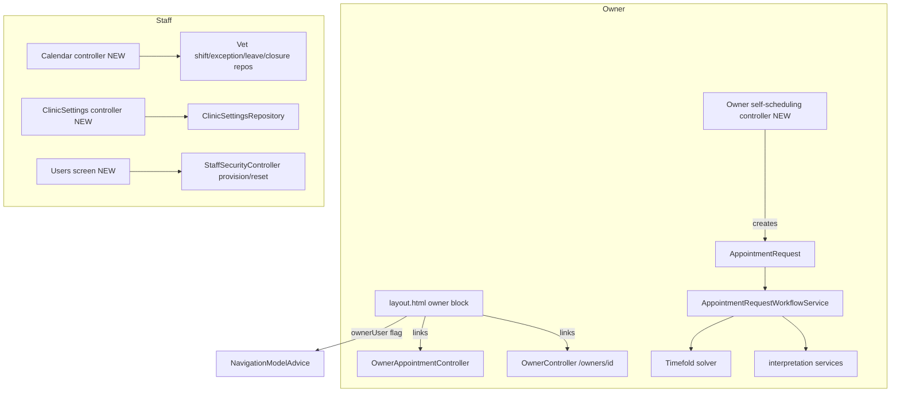

# Requirements

### Overview & Goals

Create a new focused OpenSpec change named **`expose-scheduling-ui`** that closes the gap between the implemented backend of `smart-appointment-scheduling` and what users can actually reach in the UI. Owners currently cannot navigate to their own data or scheduling, and staff have no screens for user management, the clinic calendar, or clinic settings — even though the domain, repositories, and most controllers already exist.

This change follows the same OpenSpec **spec-driven** conventions as the existing change (proposal.md, `specs/**/spec.md` deltas, design.md, tasks.md). It is a **planning artifact only** — no Java/Thymeleaf/migration code is written as part of it.

### Scope

**In scope** (all four gap areas, per user confirmation):
- **Owner navigation & landing** — owner-visible menu links (“My data” → `/owners/{id}`, “My appointments” → `/owners/{id}/appointments`) and an owner-aware landing, reusing existing `myAppointments` / `viewAppointments` message keys.
- **Owner self-scheduling** — a new owner-facing controller to **initiate** an `AppointmentRequest` and drive the guided **accept/reject/ask-again** loop through the **full guided AI flow** (consent gate → AI interpretation → Timefold single-slot suggestion). Today only `resume` is wired and the only booking entry point is `hasRole('STAFF')`.
- **Staff calendar & clinic settings** — new controllers + templates over the already-built `calendar` repositories (`VetWeeklyShiftRepository`, `VetAvailabilityExceptionRepository`, `VetLeaveRepository`, `ClinicClosureRepository`) and `ClinicSettingsRepository`.
- **Staff user management** — a users/accounts screen wiring the existing `provision` / `reset-password` endpoints (`StaffSecurityController`) into `ownerDetails.html` plus a simple accounts list.

**Out of scope**
- Writing the actual feature Java/Thymeleaf/migration code (done later via the apply workflow).
- Owner self-registration, password recovery, exposing the full calendar to owners, notifications, multiple clinics, waitlists (remain out of scope of the parent feature).

### User Stories
- As an **owner**, I want menu links to my own data and appointments so I can reach them after login without staff-only navigation.
- As an **owner**, I want to start a scheduling request in plain language and be guided to a suitable slot so I can self-serve booking.
- As **staff**, I want screens to manage user accounts, veterinarian availability/closures, and clinic settings so I can administer the clinic end to end.

### Functional Requirements (captured as spec deltas)
- Owner-scoped navigation renders only for authenticated owners and links to owner-guarded endpoints already protected by `@ownerSecurity.canAccessOwner`.
- Owner self-scheduling initiation creates an `AppointmentRequest` and enters the guided flow behind the existing consent gate; validation/AI/solver failures route to the staff fallback queue (unchanged behavior).
- Static urgent-care guidance stays visible unconditionally on owner scheduling screens (existing safety requirement, preserved).
- Staff screens are guarded by `@PreAuthorize("hasRole('STAFF')")`, mirroring existing staff controllers.

### Non-Functional Requirements
- No new backend capabilities are introduced; the change is an exposure/UI slice over existing services and repositories.
- Maintains existing security guarantees (owner scoping, staff-only management, anonymous urgent-care).

# Technical Design

### Current Implementation (verified in code)

- **Owner side is implemented but unreachable via nav:** `OwnerController` (`/owners/{id}`) and `OwnerAppointmentController` (`/owners/{ownerId}/appointments`, `.../cancel`, `.../appointment-requests/{id}/resume`) exist and are owner-scoped. But `NavigationModelAdvice` exposes **only** `staffUser` — no `currentOwnerId`/`ownerUser` — so `fragments/layout.html` cannot render an owner link. Message keys `myAppointments`, `viewAppointments` already exist and are unused in nav.
- **Owner self-scheduling initiation is missing:** the guided services exist (`AppointmentRequestWorkflowService`, `scheduling/solver/*`, `SlotHoldAcquisitionService`, `scheduling/interpretation/*`, `OwnerSchedulingResumeService`), but the only booking entry point `/owners/{ownerId}/pets/{petId}/appointments/new` lives in `StaffBookingController` under `hasRole('STAFF')`. There is no owner *create-request* / accept-reject controller.
- **Staff calendar & clinic settings web layer is entirely missing:** `calendar/` has entities + repositories only (no `@Controller`); `templates/calendar` is empty. No `ClinicSettings` controller/template.
- **Staff user management has endpoints but no screen:** `StaffSecurityController` exposes `provision` / `reset-password` POSTs; no button in `ownerDetails.html` and no accounts list.

### Key Decisions
- **New focused change, not an extension.** Author a standalone OpenSpec change `expose-scheduling-ui` (spec-driven schema, matching `smart-appointment-scheduling`) rather than editing the parent change, keeping this UI-exposure slice independently reviewable.
- **Owner self-scheduling uses the full guided AI flow** (user-selected): free-text availability → consent gate → AI interpretation → Timefold single-slot suggestion → accept/reject/ask-again, reusing existing services; no new solver/AI logic, only a new owner-facing controller + templates.
- **Spec deltas describe UI exposure over existing capabilities.** Because the base behavior already exists, deltas mostly ADD UI-reachability requirements to `security` (owner nav + owner self-scheduling entry), `calendar` (staff calendar/settings screens), and `staff`/`appointment` where relevant — no MODIFY to already-correct backend requirements.
- **Planning only.** This change writes OpenSpec artifacts; implementation happens later via the apply workflow.

### Proposed Changes (content the OpenSpec artifacts will describe)
The change's `tasks.md` will slice the eventual implementation into the four gap areas, each mapping to concrete files:
- **Owner nav & landing:** add `ownerUser` + `currentOwnerId` to `NavigationModelAdvice` (resolved from `AppUser.owner`); add a `th:if="${ownerUser}"` block in `fragments/layout.html`; optional owner-aware landing in `WelcomeController`.
- **Owner self-scheduling:** new owner-facing controller (initiate `AppointmentRequest`, drive consent/accept/reject/ask-again via existing services) + templates under `templates/owners` or `templates/scheduling`.
- **Staff calendar & settings:** new `@PreAuthorize("hasRole('STAFF')")` controllers + `templates/calendar/*` over the four availability repositories and `ClinicSettingsRepository`.
- **Staff users:** wire `provision`/`reset-password` buttons into `ownerDetails.html` and add an accounts list screen.

### File Structure (of the OpenSpec change to be created)
```
openspec/changes/expose-scheduling-ui/
  .openspec.yaml            # schema: spec-driven
  proposal.md               # why + what changes + scope + delivery slicing
  design.md                 # how: controllers/templates/nav wiring, reuse of services
  specs/
    security/spec.md        # owner nav + owner self-scheduling entry deltas
    calendar/spec.md        # staff calendar + clinic settings screen deltas
    staff/spec.md           # staff user-management screen deltas (as needed)
    appointment/spec.md     # owner self-scheduling initiation exposure (as needed)
  tasks.md                  # implementation steps sliced by the 4 areas
```

### Architecture Diagram


### Risks
- **Full guided flow depends on later slices (AI/solver) being usable.** The change should note that owner self-scheduling assumes slices 2–3 of the parent feature are in place; otherwise requests fall back to the staff queue (already handled).
- **Owner landing redirect** must not break staff/anonymous flows — keep `defaultSuccessUrl` behavior optional and role-aware.
- **Spec delta placement** must respect the parent change's capability paths to avoid conflicting requirements.

# OpenSpec Authoring

### How the change will be produced

The change is authored with the **`openspec-propose`** workflow/CLI (spec-driven schema), matching the existing `smart-appointment-scheduling` change layout.

Steps the authoring will follow:
1. `openspec new change "expose-scheduling-ui"` (default spec-driven schema) to scaffold `.openspec.yaml` + skeleton.
2. `openspec status --change "expose-scheduling-ui" --json` to get the required artifact set and build order.
3. For each artifact (`proposal` → `specs` → `design` → `tasks`), run `openspec instructions <id> --change "expose-scheduling-ui" --json` and write the file to its `resolvedOutputPath` using the returned template.
4. `openspec validate` / `openspec status` to confirm all artifacts are `done`.

### Artifact contents (summary)
- **proposal.md** — Why (backend implemented, UI gap), What Changes (4 areas), Capabilities touched (exposure of `security`/`calendar`/`appointment`/`staff`), Scope, Delivery slicing, Impact.
- **specs/**/spec.md** — ADDED requirements for UI reachability with GIVEN/WHEN/THEN scenarios (owner nav visible only to owners; owner self-scheduling initiation; staff calendar/settings/users screens guarded by `hasRole('STAFF')`; urgent-care guidance preserved).
- **design.md** — concrete controllers/templates, `NavigationModelAdvice` changes, reuse of existing services/repositories, and the note that no new backend capabilities are added.
- **tasks.md** — implementation steps grouped by the four gap areas (to be executed later via the apply workflow).

> Note: although the request mentions only `proposal.md`/`tasks.md`, the repo's **spec-driven** schema also requires `specs/**/spec.md` and (conditionally) `design.md`; these are included to keep the change valid and consistent with the parent.

# Delivery Steps

### ✓ Step 1: Scaffold change and author proposal.md
A new spec-driven OpenSpec change `expose-scheduling-ui` exists with a complete `proposal.md`.

- Run `openspec new change "expose-scheduling-ui"` to scaffold `openspec/changes/expose-scheduling-ui/` with `.openspec.yaml` (schema: spec-driven).
- Run `openspec status --change "expose-scheduling-ui" --json` to obtain the required artifact set and build order.
- Write `proposal.md` following `openspec instructions proposal`: Why (backend of `smart-appointment-scheduling` is implemented but unreachable in the UI), What Changes (the four gap areas), Capabilities touched, Actors, Scope (in/out), Delivery slicing by area, and Impact.
- Explicitly note this is a planning artifact and that owner self-scheduling uses the full guided AI flow.

### ✓ Step 2: Author owner-facing spec deltas (nav + self-scheduling)
Spec deltas describe how owners reach their data and self-schedule.

- Write `specs/security/spec.md` ADDED requirements: owner-visible navigation (`ownerUser`/`currentOwnerId` via `NavigationModelAdvice`) linking to `/owners/{id}` and `/owners/{id}/appointments`, rendered only for authenticated owners.
- Write `specs/appointment/spec.md` (and/or `scheduling` delta) for owner self-scheduling initiation: an owner creates an `AppointmentRequest` and enters the guided consent → interpret → suggest → accept/reject/ask-again loop reusing existing services.
- Include GIVEN/WHEN/THEN scenarios and preserve the unconditional urgent-care guidance requirement.
- Reference concrete existing code: `OwnerController`, `OwnerAppointmentController`, `AppointmentRequestWorkflowService`, `OwnerSchedulingResumeService`.

### ✓ Step 3: Author staff-facing spec deltas (calendar, settings, users)
Spec deltas describe the missing staff management web layer.

- Write `specs/calendar/spec.md` ADDED requirements for staff screens over `VetWeeklyShiftRepository`, `VetAvailabilityExceptionRepository`, `VetLeaveRepository`, `ClinicClosureRepository`, and a view/edit form over `ClinicSettingsRepository`, all guarded by `hasRole('STAFF')`.
- Write/extend `specs/staff/spec.md` for a user-management screen that wires the existing `provision` / `reset-password` endpoints (`StaffSecurityController`) plus an accounts list.
- Include GIVEN/WHEN/THEN scenarios for each management screen and its authorization boundary.

### ✓ Step 4: Author design.md
`design.md` explains how the exposure is implemented over existing components.

- Follow `openspec instructions design`; read the completed proposal and spec deltas from disk first.
- Detail concrete changes: `NavigationModelAdvice` owner flags, `fragments/layout.html` owner block, optional owner-aware landing in `WelcomeController`, new owner self-scheduling controller + templates, new staff calendar/settings controllers + `templates/calendar/*`, and users screen wiring in `ownerDetails.html`.
- State explicitly that no new backend capabilities are added and list the reused services/repositories.
- Include the risk that owner self-scheduling depends on the parent feature's AI/solver slices, with staff-queue fallback.

### ✓ Step 5: Author tasks.md and validate the change
`tasks.md` slices the implementation and the whole change validates cleanly.

- Follow `openspec instructions tasks`; group implementation steps by the four gap areas (owner nav & landing, owner self-scheduling, staff calendar & settings, staff user management).
- Keep tasks scoped to UI/exposure work over existing services; do not introduce new backend capabilities.
- Run `openspec status --change "expose-scheduling-ui"` (and `openspec validate` if available) to confirm every required artifact is `done`.
- Summarize the created change location and artifacts, and stop (implementation happens later via the apply workflow).