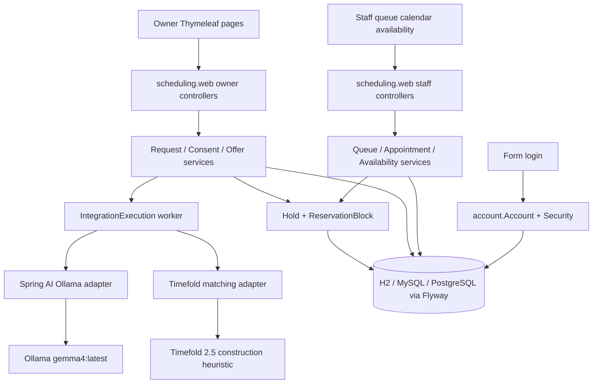

# Requirements

### Overview & Goals

Implement the **Smart Appointment Scheduling** feature for Spring PetClinic exactly as specified in `specs/001-smart-appointment-scheduling/`. Execution follows `/speckit-implement`: `tasks.md` is the ordered work list (T001–T144), tests are written first, and both Maven and Gradle stay in sync.

Owners describe a visit in plain English, review a structured interpretation, receive **one** Timefold-chosen suggestion at a time, and book it atomically. Staff handle fallback, emergencies, capacity, and appointment lifecycle. Legacy owners, pets, vets, specialties, and visits remain intact.

### Scope

#### In Scope

- Desktop Thymeleaf owner and staff flows from `spec.md` user stories US1–US9.
- Accounts with form login (`OWNER` / `STAFF`), CSRF, JDBC sessions, and profile-gated bootstrap.
- Flyway migrations for H2, MySQL, and PostgreSQL; `visits` extended with nullable `appointment_id` and `vet_id`.
- Durable LLM interpretation (Ollama `gemma4:latest` via Spring AI) and Timefold matching, with persisted `IntegrationExecution` jobs.
- Authoritative 15-minute `ReservationBlock` holds, offer accept/reject/expiry, staff booking, and Visit creation on completion.
- Existing `/owners/**`, `/pets/**`, `/vets/**` restricted to `STAFF`; owner self-service on `/owner/**`.

#### Out of Scope

- Recurring appointments, waitlists, payments, insurance, SMS/email, mobile/responsive UX, WCAG suite.
- Auto-booking without owner confirmation; owner-visible calendars of alternatives; multi-request Timefold solving.
- Failed-login throttling, live Ollama in CI, extra broker/queue infrastructure.

### User Stories

1. **US1 — Describe and confirm** — Owner submits 10–2,000 character prose, consents, reviews interpreted fields, and confirms before any suggestion.
2. **US2 — Receive and accept one suggestion** — Timefold holds one slot; owner accepts atomically or the hold expires/releases without a partial booking.
3. **US3 — Recover from a rejected or expired offer** — Owner gets another suggestion, fallback, or staff; fifth rejection/expiry goes to staff.
4. **US4 — Staff assist when automation cannot finish** — One queue item per request; staff interpret, hold a slot, book, or close with a reason.
5. **US5 — Detect possible emergencies** — Raise-only term screen; owners see urgent-care guidance; no LLM on emergency/declined text.
6. **US6 — Clinic hours, specialties, and veterinarian time** — Staff-configured capacity; mutations cannot invalidate confirmed appointments or active holds.
7. **US7 — Keep the appointment accurate after booking** — Reschedule (same ID), cancel, complete→Visit, no-show, audited correction.
8. **US8 — Owner self-service** — Dashboard, resume, history, cancel before start; original request stays closed.
9. **US9 — Accounts and access** — Staff-only catalog pages; owner ID from the session; cross-owner IDs are 404.

### Functional Requirements

Behavior is defined by `spec.md` FR-001–FR-048 and contracts in `specs/001-smart-appointment-scheduling/contracts/`:

- MVC routes, CSRF, Post/Redirect/Get, `expectedVersion` → 409 stale page (`mvc-routes.md`).
- Owner-safe vs staff-only JSON (`owner-operation-status.schema.json`, `staff-operation-status.schema.json`).
- LLM schema/prompt (`llm-interpretation.schema.json`, `llm-interpretation-prompt.md`); Timefold snapshot/result (`timefold-solver-input.schema.json`, `timefold-solver-result.schema.json`).
- Form fields and 409/validation UX (`forms.md`).

Success criteria SC-001–SC-012 in `spec.md` are the acceptance bar (interpretation p95 ≤ 10s, matching p95 ≤ 5s, atomic accept/reject, no overlapping reservations, no owner leakage of staff/solver internals).

### Non-Functional Requirements

- Java 21; Spring Boot 4.1.0; Timefold 2.5.0; Spring AI 2.0.1 BOM; Spring Security + Session JDBC + Flyway.
- UTC `Instant` storage; clinic `ZoneId` on snapshots; 15-minute grid.
- Idempotent job triggers; workers run after commit; GET never mutates.
- Maven and Gradle both compile and test the same change set.
- Synthetic data only under `local` / `demo` / `test`; deployed profiles fail without configured staff credentials.

# Technical Design

### Current Implementation

Stock Spring PetClinic 4.x modular monolith:

- Spring Boot **4.1.0**, Java **17**, JPA, Thymeleaf, Validation, Caffeine cache.
- Schema via `spring.sql.init` + `src/main/resources/db/{h2,mysql,postgres}/{schema.sql,data.sql}` (`ddl-auto=none`).
- Domain: `Owner`, `Pet`, `Visit` (`src/main/java/org/springframework/samples/petclinic/owner/`), `Vet` / `Specialty` (`.../vet/`). `Visit` has only `visit_date` and `description`.
- MVC: package-private controllers (e.g. `OwnerController`) with form POST + redirect; no Spring Security.
- Tests: `@WebMvcTest` controller tests, Testcontainers MySQL, dual Maven/Gradle builds.
- **No** `account` or `scheduling` packages, no Flyway, no Timefold, no Spring AI.

Authoritative design already exists in:

- `specs/001-smart-appointment-scheduling/plan.md`
- `research.md`, `data-model.md`, `quickstart.md`
- `contracts/*`
- `tasks.md` (T001–T144)

### Key Decisions

Taken from `research.md`; implementation will not reopen them:

1. **Modular monolith** — new `account` package plus `scheduling` subpackages (`request`, `interpretation`, `matching`, `availability`, `appointment`, `queue`, `audit`, `job`, `web`). Controllers bind/validate; transactional services own mutations; adapters isolate Ollama and Timefold.
2. **Java 21 + dual build** — upgrade `pom.xml` `java.version` and `build.gradle` toolchain together; add Security, Session JDBC, Flyway, Spring AI Ollama, Timefold 2.5.0, PostgreSQL Testcontainers. Boot 4.1.0 overrides Spring AI’s Boot 4.1.1 transitives.
3. **Flyway replaces `spring.sql.init`** — `classpath:db/migration/${database}` with `V1__legacy_petclinic_schema.sql` (preserve existing IDs/rows) and `V2__smart_appointment-scheduling.sql`. One-shot `baseline-on-migrate=true` profile for non-empty schemas.
4. **Durable jobs, not a broker** — persist `IntegrationExecution` in the same TX as the state change, dispatch ID after commit on a bounded `ThreadPoolTaskExecutor`. Unique `triggerKey`; claim + ≤2 attempts; deadline includes queue time.
5. **Timefold is advisory** — one nullable planning entity, construction heuristic only, `EasyScoreCalculator` → pure `SlotScorePolicy`, then transactional hold acquisition with one stale-snapshot retry. Staff exact-slot booking skips Timefold but uses the same eligibility/blocks.
6. **Portable overlap control** — `ReservationBlock` composite PK `(resource_type, resource_id, block_start)`; `ActivePetRequest` guard instead of partial indexes; JPA `@Version` + form `expectedVersion` → HTTP 409.

### Architecture Diagram

### Proposed Changes

**Build and runtime**

- `pom.xml` / `build.gradle`: Java 21; Spring AI BOM 2.0.1; Timefold 2.5.0; starters for Security, Session JDBC, Flyway, Ollama, Timefold; test Security + PostgreSQL Testcontainers.
- `src/main/resources/application.properties`: disable `spring.sql.init`; `spring.flyway.locations=classpath:db/migration/${database}`; session JDBC + 30-minute idle; Ollama/Timefold config.
- Profiles `local` / `demo` / `test` seed one account per synthetic owner plus `admin`; deployed profiles require staff credentials at startup.

**Persistence**

- Per-dialect Flyway: `src/main/resources/db/migration/{h2,mysql,postgres}/V1__legacy_petclinic_schema.sql` and `V2__smart_appointment_scheduling.sql`.
- Extend `visits` with unique nullable `appointment_id` and `vet_id`; keep legacy rows null.
- New tables per `data-model.md`: `accounts`, Spring Session tables, request/revision/consent/interpretation, `integration_executions` / attempts, offers, holds, `reservation_blocks`, appointments, queue/notes, clinic policy/hours/durations/periods/closures, vet shifts/exceptions/leave, `audit_events`, `active_pet_requests`.

**Existing Java to change**

- `Visit`: nullable `appointmentId`, `vetId`; completion writes clinical notes into `description` and the actual local date into `visit_date`.
- `OwnerController`, pet/visit controllers, `VetController`: `STAFF` only; owner self-service does not use `/owners/{ownerId}`.
- Templates (`layout.html` and related): staff vs owner nav; login; CSRF on every POST.
- `PetClinicApplication` / config: import Security, session, async executor, scheduling modules.

**New packages (`src/main/java/org/springframework/samples/petclinic/`)**

| Package | Responsibility |
|---|---|
| `account` | `Account` entity/repo, `UserDetailsService`, form-login `SecurityFilterChain`, password change/reset, profile-gated bootstrap |
| `scheduling.request` | `SchedulingRequest`, text revisions, consent, `ActivePetRequest`, request workflow |
| `scheduling.interpretation` | Emergency screen, LLM adapter, Jackson/Jakarta/clinic validation, `InterpretationRecord`, `RequestRevision` / windows |
| `scheduling.matching` | Snapshot builder, Timefold solution/entity/`SlotScorePolicy`, hold acquisition, `Offer` |
| `scheduling.availability` | Policy, hours, named periods, closures, vet shifts/exceptions/leave, eligibility |
| `scheduling.appointment` | `Appointment`, `Hold`, `ReservationBlock`, accept/reject/expire, complete→`Visit` |
| `scheduling.queue` | `StaffQueueItem`, `QueueNote`, claim/unclaim/reassign |
| `scheduling.audit` | Append-only `AuditEvent` in the same TX as protected mutations |
| `scheduling.job` | `IntegrationExecution` / `IntegrationAttempt`, claim, after-commit dispatch, startup recovery |
| `scheduling.web` | Owner and staff controllers, 409 handler, operation-status JSON, Thymeleaf views |

**Critical transactional boundaries** (from `data-model.md`):

- Create request + `ActivePetRequest` in one TX.
- Consent + state + `IntegrationExecution` in one TX; HTTP call after commit.
- Offer + hold + all vet/pet blocks in one TX after current-fact revalidation; uniqueness collision rolls back the whole hold.
- Accept: lock request/offer/hold, check expiry, create appointment, convert blocks, close queue, drop guard, audit — one TX.
- GET/polling never expire holds or start jobs.

### Data Models / Contracts

Entities and transitions: `data-model.md`.

Request states: `AWAITING_CONSENT` → `INTERPRETING` → `INTERPRETATION_REVIEW` → `READY_FOR_SUGGESTION` → `MATCHING` → `OFFER_HELD` / `AWAITING_FALLBACK_CHOICE` → `CONFIRMED` or `STAFF_HANDLING` / `CLOSED`.

Owner JSON poll (no internals): `status`, `ownerStatusCode`, `expiresAt`, `retryAllowed`, `canonicalPath`.
Staff JSON may add `errorClassification`, attempt timing, score components.

LLM: versioned schema + prompt in `src/main/resources/scheduling/`; `OllamaChatOptions.outputSchema`; application validation strips unknown fields into audit JSON; ≤2 calls inside one 10s deadline.
Timefold: `PREFERRED_ONLY` vs `ALLOWED_FALLBACK`; incomplete/early termination is not offerable.

### File Structure

**Add**

- `src/main/resources/db/migration/{h2,mysql,postgres}/V1__*.sql`, `V2__*.sql`
- `src/main/resources/scheduling/` prompt, JSON Schema, messages
- `src/main/resources/templates/{login,owner/**,staff/**,account/**,error/**}.html`
- Java under `account/` and `scheduling/` as above
- Tests mirroring that tree under `src/test/java/...`

**Modify**

- `pom.xml`, `build.gradle`
- `src/main/resources/application.properties` (+ profile files)
- `Visit.java` (+ visit persistence/tests)
- Existing owner/vet/pet controllers and `src/test/java/.../owner/*ControllerTests.java`
- `src/main/resources/templates/fragments/layout.html` (and current nav fragments)
- `src/test/java/org/springframework/samples/petclinic/PetClinicIntegrationTests.java` and Testcontainers apps

**Retire as schema owner** (content moved into Flyway V1): `src/main/resources/db/{h2,mysql,postgres}/schema.sql` via `spring.sql.init` disabled. Demo catalog data moves to repeatable migrations or profile bootstrap.

### Risks

- **Dual-build drift** — every dependency/Java change lands in both `pom.xml` and `build.gradle`; verify both test suites.
- **Hold races** — rely on `ReservationBlock` uniqueness, not check-then-insert; add barrier tests (T018, T054, T108).
- **Stale Timefold results** — revalidate facts before insert; one retry; then staff (T053).
- **LLM budget** — disable Spring AI retries/validateSchema loops; application-owned 10s/2-attempt cap (T008, T036).
- **Security regressions** — existing controller tests must become staff-authenticated; owner ID always from `Account`, never from the path (T021, T125, T139).
- **Flyway vs existing DBs** — V1 preserves rows; baseline profile is one-time only (T003, T136).

# Testing

### Validation Approach

Follow `tasks.md` TDD: for every numbered task, add or extend the listed tests, run them and confirm they fail, then implement until they pass. Do not mark a task complete in `tasks.md` while its tests fail.

Layers (from `research.md` §11):

- Pure unit tests for validators, request/offer/appointment transitions, `SlotScorePolicy`, deadlines.
- Full Timefold tests for preferred/fallback selection, repeatability, incomplete-termination rejection.
- `@WebMvcTest` with the real `SecurityFilterChain` for authz, CSRF, 409 stale pages, polling JSON.
- Persistence/IT against H2 plus MySQL and PostgreSQL Testcontainers (Flyway, uniqueness, races).
- Thin full-context tests with deterministic LLM/Timefold test adapters.
- Live Ollama remains opt-in and is **not** part of default CI (`quickstart.md`).

Existing tests to update when catalog routes become staff-only: `OwnerControllerTests`, visit/pet controller tests, `VetControllerTests`, `PetClinicIntegrationTests`.

### Key Scenarios

- Owner happy path: prose → consent → interpretation review → confirm → one suggestion → accept → `CONFIRMED` appointment (US1+US2; SC-001, SC-003, SC-008).
- Polling resumes the same `IntegrationExecution`; refresh does not start a second LLM/Timefold job (FR-007, FR-043).
- Accept of an unexpired hold creates the appointment and converts every block in one TX; expired/stale accept shows unavailable, never a partial booking (SC-003).
- Reject/expiry releases blocks, excludes the slot, and offers another suggestion until the fifth event sends the request to staff (US3; SC-004).
- Staff queue: one item per request; claim/unclaim/reassign with reason; exact-slot hold and direct book; close without an appointment (US4; SC-005).
- Emergency terms raise urgency only, skip LLM, show urgent-care guidance (US5; SC-006).
- Availability mutation that would break a confirmed appointment or active hold is rejected (US6; SC-007).
- Complete creates exactly one `Visit` with `appointment_id`/`vet_id`; no-show creates none; reschedule keeps appointment ID (US7; SC-009).
- Cross-owner IDs → 404; owner hitting staff routes → 403; unauthenticated HTML → `/login` (US9; SC-010).

### Edge Cases

- Stale `expectedVersion` → 409 page with current state and safe submitted values; command is not replayed (T022, T140).
- Competing holds on the same vet/pet blocks: one winner, the other rolls back completely (T018, T054).
- Solver finishes after deadline or `terminateEarly()`: attempt recorded, no `Offer` (T017, T053).
- LLM unknown fields audited and ignored; invalid/uncertain → staff, not a second “please clarify” model call (T007, T037).
- Declined or emergency text is never sent to Ollama (T038, T086).
- Temporary password: only password-change and logout until changed; reset deletes all Spring Session rows for that username (T024, T132).
- Owner responses omit queue assignment, staff notes, raw model output, scores, and error classes (T044, T062, T123, T141).

### Test Changes

Add tests listed under each task in `tasks.md` (illustrative):

- `SchedulingSecurityConfigurationTests`, `AccountBootstrapTests`
- `RequestWorkflowTests`, `ConsentServiceTests`, `InterpretationSchemaValidatorTests`, `EmergencyScreeningServiceTests`
- `SlotScorePolicyTests`, `TimefoldMatchingServiceTests`, `HoldAcquisitionServiceTests`, `OfferAcceptanceServiceTests`
- `StaffQueueServiceTests`, `AppointmentLifecycleServiceTests`, `AvailabilityCommandServiceTests`
- `OwnerSchedulingControllerTests`, `StaffQueueControllerTests`, `OwnerOperationStatusControllerTests`
- `FlywayMigrationTests`, barrier concurrency tests, `SchedulingIsolationIT`

Update existing MVC/IT tests for authentication and the Visit schema extension. Run `./mvnw test` and `./gradlew test` before treating a phase as done.

# Delivery Steps

### ✓ Step 1: Setup, Flyway, accounts, and scheduling foundation
The app runs on Java 21 with Flyway, Spring Security accounts, and scheduling skeleton packages; existing catalog routes are staff-only.

- Execute T001–T025 from `specs/001-smart-appointment-scheduling/tasks.md` in order, tests first.
- Upgrade Java 21 and add Security, Session JDBC, Flyway, Spring AI 2.0.1, Timefold 2.5.0, PostgreSQL Testcontainers in both `pom.xml` and `build.gradle`.
- Replace `spring.sql.init` with Flyway `V1` (legacy schema) + `V2` (scheduling tables/constraints/seed policy) under `src/main/resources/db/migration/{h2,mysql,postgres}/`.
- Implement `account` (BCrypt `Account`, form login, CSRF, JDBC sessions, profile-gated bootstrap) and restrict existing `/owners/**`, `/pets/**`, `/vets/**` to `STAFF`.
- Add scheduling foundation: UTC/grid types, `AuditEvent`, `IntegrationExecution` worker/recovery, `StaffQueueItem`, clinic policy/hours/durations, `ReservationBlock` + `ActivePetRequest` uniqueness, `@Version`/409 handler, owner vs staff projections, Thymeleaf progress/nav layout.
- Extend `Visit` with nullable `appointmentId`/`vetId` without rewriting legacy rows.
- Mark each completed task in `tasks.md`; keep Maven and Gradle green.

### ✓ Step 2: Owner request capture and LLM interpretation
An owner can submit prose, consent, review a structured interpretation, and confirm a revision (US1 / T026–T044).

- Add `SchedulingRequest`, `RequestTextRevision`, `ActivePetRequest`, consent records, and owner new-request/dashboard pages (`/owner/scheduling-requests`, `/owner/dashboard`).
- Dedicated consent page; Agree creates one `LLM_INTERPRETATION` execution after commit; Decline creates/retains the queue item and skips the LLM.
- Spring AI Ollama adapter with versioned schema/prompt from `contracts/`; disable framework retries; validate with Jackson 3 + Jakarta + clinic rules; unknown fields audited and ignored.
- Interpretation review page with resolved dates, top-issue summary, text-plus-icon field issues; owner edits save a draft revision without calling the LLM.
- Confirm only when required fields and clinic values are valid; otherwise keep the request in review.
- Idempotent processing page + owner-safe poll JSON; GET never starts work.
- Cover with `RequestWorkflowTests`, `ConsentServiceTests`, `InterpretationSchemaValidatorTests`, `OwnerSchedulingControllerTests`, and owner projection leak tests.

### ✓ Step 3: Timefold matching, holds, and atomic acceptance
Confirmed requests get one Timefold-chosen held offer that the owner can accept or reject without partial bookings (US2 / T045–T062).

- Build an immutable solver snapshot and Timefold model: one planning entity, construction heuristic only, `EasyScoreCalculator` delegating to `SlotScorePolicy`.
- `PREFERRED_ONLY` solve on “Request suggestion”; persist `TIMEFOLD_MATCH` execution; poll with no percentage.
- After a natural complete solve, revalidate current facts and insert all vet/pet `ReservationBlock` rows with the hold/offer in one TX; on conflict, one snapshot refresh + rerun, then staff.
- Offer page with server-authoritative countdown; accept converts blocks to an appointment, closes the queue, and drops `ActivePetRequest` atomically.
- Reject (inline confirm) or expiry releases blocks, records outcome, and returns the owner to ready-for-suggestion without listing alternatives.
- Add `SlotScorePolicyTests`, `TimefoldMatchingServiceTests`, `HoldAcquisitionServiceTests`, `OfferAcceptanceServiceTests`, and barrier tests for competing holds.

### ✓ Step 4: Owner recovery, staff fallback, and emergency screening
Rejected/expired offers recover safely, staff can finish any request, and possible emergencies never reach the LLM (US3–US5 / T063–T092).

- Subsequent suggestion, fallback-choice page, owner-authorized `ALLOWED_FALLBACK` solve, and forward-to-staff; fifth rejection/expiry sends the request to staff (T063–T071).
- Staff queue workspace: emergency-first ordering, claim/unclaim/reassign with reasons, notes, manual interpretation without LLM, exact-slot hold, direct book with evidence, close with resolution (T072–T082).
- Raise-only emergency term screen before the LLM; persistent urgent-care guidance; staff-handling copy without extra questions (T083–T092).
- Keep a single queue item per request on every fallback path; never expose staff notes, scores, or error classes to owners.
- Tests: `OfferRecoveryServiceTests`, `StaffQueueServiceTests`, `EmergencyScreeningServiceTests`, `StaffQueueControllerTests`, plus no-LLM-on-emergency/decline cases.

### * Step 5: Clinic capacity, appointment lifecycle, and owner self-service
Staff can configure capacity and manage appointments; owners can resume, inspect history, and cancel before start (US6–US8 / T093–T123).

- Availability and settings pages for hours, durations, named periods, closures, emergency terms, vet shifts/exceptions/leave; reject mutations that would invalidate confirmed appointments or active holds; bump `configurationVersion` (T093–T102).
- Staff calendar; reschedule (same appointment ID, atomic block replace); cancel; complete at/after end creating exactly one linked `Visit`; no-show with no Visit; audited terminal correction (T103–T114).
- Owner dashboard resume URL (server-derived, never `nextUrl`), appointments list/detail, history, and cancel-before-start leaving the original request closed (T115–T123).
- Tests: `AvailabilityCommandServiceTests`, `AppointmentLifecycleServiceTests`, `VisitCompletionTests`, `OwnerDashboardControllerTests`, `OwnerHistoryProjectionTests`, plus conflict/barrier cases.

###   Step 6: Account provisioning and cross-cutting verification
Staff can provision and reset owner accounts, and the full spec (SC-001–SC-012) passes on Maven and Gradle (US9 + polish / T124–T144).

- Password-change flow, session rotation, staff provision/reset with one-time password shown once, seven-day expiry, and Spring Session invalidation on reset (T124–T132).
- Cross-cutting polish: Flyway on all three databases; idempotent job recovery; 409 stale-write pages; owner/staff JSON contract tests; dual-build dependency alignment; `quickstart.md` local/demo path (T133–T144).
- Full-stack isolation tests for the owner journey, staff fallback, emergency path, and concurrency; confirm no owner leakage of internals.
- Run `./mvnw test` and `./gradlew test`; only then mark remaining `tasks.md` items complete.