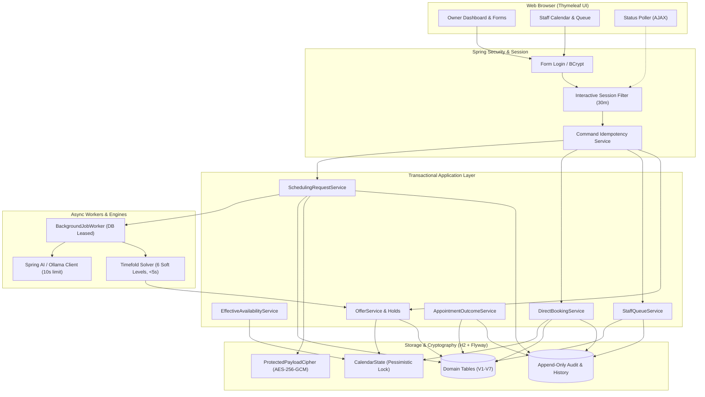

# Requirements

### Overview & Goals
The objective of this project is to implement the **Smart Appointment Scheduling** feature for Spring PetClinic. Pet owners describe their scheduling needs and visit reason in free-form English, review an AI-generated structured interpretation, and receive a deterministic, Timefold-optimized single appointment offer held temporarily for their acceptance. Clinic staff manage clinic availability, review and action fallback requests, directly schedule appointments, record outcomes, and provision owner access.

### Scope

#### In Scope
- **Owner Smart Scheduling**: Consented prose input, AI interpretation via Spring AI / Ollama, review/correction of structured fields, deterministic Timefold slot matching (under 5s), single held slot offer (10 min hold), acceptance to confirmed appointment.
- **Staff Availability & Direct Booking**: Recurring shifts, date-specific replacement exceptions, veterinarian leave, clinic closures, staff calendar view (week & table), and direct booking with conflict detection.
- **Staff Fallback Queue**: Automatic routing for declined consent, priority/emergency keywords, parsing ambiguity, solver no-match, or technical timeouts; queue claim/unclaim/reassign, manual interpretation, owner contact tracking, assisted offers, and reasoned closure.
- **Lifecycle & History Management**: Owner structured edits, prose revisions (with renewed consent), offer rejection/expiry/retry (up to 5 automatic offers), pre-confirmation withdrawal, owner cancellation before start, staff completion/no-show with clinical notes, append-only outcome corrections, and future legacy visit reconciliation.
- **Security & Accounts**: Local `OWNER` and `STAFF` credentials, temporary password generation with forced change, global session invalidation on reset, role-based route separation, CSRF protection, 30-minute interactive session timeout (polling non-extending), AES-256-GCM envelope encryption for sensitive payloads, and append-only staff audit / owner history.
- **Execution Strategy**: Phase-by-phase execution via `/speckit-implement`, followed by `/speckit-converge` post-phase verification and gap closure, concluding each phase with a git commit before proceeding to the next.

#### Out of Scope
- Owner self-registration and self-service password recovery.
- Clinic-wide full availability calendar exposure to pet owners.
- External notifications (SMS/Email) and waitlists.
- Multiple clinic locations, room/equipment resources, and multi-veterinarian appointments.
- Owner editing of pet records and staff editing of vet/specialty catalogs.
- MySQL and PostgreSQL runtime support in phase one (H2 file-backed and in-memory only).
- Gradle build system (Maven only) and non-English localization.

### User Stories
- **US1 (Priority P1) - Owner Books a Routine Appointment**: As an authenticated pet owner, I want to describe my appointment need in natural language, review the parsed details, and receive one held appointment suggestion so that I can conveniently book care without browsing the entire clinic schedule.
- **US2 (Priority P1) - Staff Resolves a Request Requiring Fallback**: As a staff member, I want an assigned queue for requests that cannot be scheduled automatically (declined consent, clinical uncertainty, no match, or system failure) so that every owner request is safely and durably handled.
- **US3 (Priority P1) - Staff Maintains Availability and Books Directly**: As a clinic staff member, I want to configure veterinarian availability, leave, and clinic closures, and directly book agreed appointments so that the clinic schedule remains accurate and conflict-free.
- **US4 (Priority P2) - Owner Manages an Active Request and Appointment**: As a pet owner, I want to revise my request, reject/retry an offer, withdraw a pending request, or cancel an upcoming appointment so that I maintain control of my schedule.
- **US5 (Priority P2) - Staff Completes and Corrects Appointment Outcomes**: As a staff member, I want to record completion visits or no-shows and make audited outcome corrections so that pet visit history remains trustworthy.
- **US6 (Priority P3) - Staff Provisions Secure Owner Access**: As a staff member, I want to generate temporary credentials for owners that force replacement on first login so that owner access is secure.

### Functional Requirements
- **FR-001 (Identity & Security)**: Enforce distinct `OWNER` and `STAFF` roles. Owners access only their own pets, requests, and appointments; staff access management routes and fallback queues.
- **FR-002 (Session & CSRF)**: 30-minute interactive session timeout. AJAX status polling (`/owner/requests/{id}/status`) must not extend the session. All mutating routes require CSRF protection and idempotent command tokens.
- **FR-003 (Sensitive Data Protection)**: Sensitive free-form prose, AI prompts/responses, clinical notes, and consent records must be stored encrypted using AES-256-GCM envelope encryption (`ProtectedPayload`).
- **FR-004 (Audit & History)**: Staff actions must append to `audit_events`. Owner actions must append to `owner_history_events`. Neither may expose update or delete APIs.
- **FR-005 (Availability Precedence)**: Effective veterinarian availability is computed with strict precedence: `ClinicClosure` > `VeterinarianLeave` > `AvailabilityExceptionDay` (replacement) > `RecurringShift`.
- **FR-006 (Calendar Locking & Concurrency)**: All calendar mutations, direct bookings, hold creations, and cancellations must acquire a pessimistic lock on `CalendarState` to prevent double-booking.
- **FR-007 (AI Interpretation)**: Consented owner prose is parsed via Spring AI / Ollama against a strict JSON schema (`interpretation-output.schema.json`) with an enforced 10-second timeout. Emergency keywords immediately trigger urgent care guidance and staff queue routing.
- **FR-008 (AI Privacy)**: If an owner declines AI consent, the text must never be sent to the AI service; the request routes directly to the staff queue.
- **FR-009 (Timefold Solver Matching)**: Single-instance deterministic solver running hard/soft constraints across 6 soft levels (owner preferred time, preferred vet, fallback window, earliest time, clinic efficiency, tie-breaker) completing within 5 seconds.
- **FR-010 (Hold & Offer Lifecycle)**: Matching creates a single held offer valid for 10 minutes. Rejection or expiry releases the hold, excludes that exact slot for the revision, and increments the offer count (capped at 5 automatic offers).
- **FR-011 (Staff Queue & Assisted Actions)**: Queue items support claim/unclaim/reassign, contact logging, manual interpretation, emergency clearance, assisted offers, direct booking, and reasoned closure.
- **FR-012 (Outcome & Legacy Reconciliation)**: Appointment completion generates a linked immutable `Visit`. Corrections append new correction events and update the current visit projection. Future legacy visits can be reconciled into scheduled appointments.

### Non-Functional Requirements
- **Performance**: Deterministic Timefold matching solves in $\le 5$ seconds. AI interpretation terminates or falls back within 10 seconds. 95% of routine requests reach offer or fallback within 20 seconds.
- **Reliability & Durability**: Background jobs use database-backed leases with automatic crash recovery. Replaying a command token returns the canonical prior result without duplicate side effects.
- **Data Integrity**: Flyway owns database migrations (`V1` to `V7`). Hibernate validates the schema. Zero database-level partial commits on transaction rollback.

# Technical Design

### Current Implementation
The existing repository is a standard Spring PetClinic application with:
- Spring Boot 4.1.0, Java 17, and legacy Gradle/Maven dual build configs.
- Unauthenticated public endpoints for owners, pets, visits, and veterinarians.
- Direct JPA repository access from Spring MVC controllers.
- Relational schema initialized via `schema.sql` and `data.sql` across H2, MySQL, and PostgreSQL.

### Key Decisions
1. **Convergence-Driven Implementation & Git Checkpoints**: Implement each phase via `/speckit-implement`, followed immediately by `/speckit-converge` verification against `spec.md`, `plan.md`, and `tasks.md`. Any identified gaps are appended and resolved before creating a git commit for the phase and advancing to subsequent phases.
2. **Platform & Database Scope**: Java 21, Spring Boot 4.1.1, Flyway migration baseline (`V1` to `V7`), H2 file-backed for demo/local and in-memory for testing; explicitly remove unused Gradle and MySQL/Postgres artifacts.
3. **Pessimistic Calendar Concurrency**: A singleton `CalendarState` row acts as the pessimistic mutex for all booking, hold, shift, and leave mutations, preventing race conditions.
4. **Envelope Encryption & Append-Only Audit**: AES-256-GCM data encryption keys wrapped with key-encrypting keys in `PayloadKeyEnvelope`. Immutable append-only tables for `audit_events`, `owner_history_events`, `command_records`, and `appointment_change_events`.
5. **Deterministic Single-Thread Timefold Matching**: Timefold Solver 2.5.0 runs single-threaded with exhaustive solving over fixed snapshot data, guaranteeing identical slot selection given the same input snapshot.
6. **Strict Role & Route Separation**: Disjoint route hierarchies (`/auth/**`, `/owner/**`, `/staff/**`, `/public/**`), 30-minute inactivity filter with polling exclusion (`/owner/requests/{id}/status`), and form-level CSRF tokens.

### Architecture Diagram



### Proposed Changes

#### 1. Security & Shared Infrastructure (`org.springframework.samples.petclinic.security`, `shared`, `audit`, `account`)
- `SecurityConfiguration`: Disjoint route rules, form login, logout, and CSRF configuration.
- `InteractiveSessionFilter`: Track last interactive access; exclude `/owner/requests/*/status` from extending session lifetime.
- `ProtectedPayloadCipher` & `ProtectedPayloadService`: AES-256-GCM encryption with versioned keys for prose, consent, clinical notes, and audit snapshots.
- `CommandService`: Idempotent token reservation, execution, result caching, and replay.
- `AccountAuthenticationService`, `AccountProvisioningService`, `PasswordResetService`, `PasswordChangeService`: Credential lifecycle with temporary password enforcement.

#### 2. Availability & Direct Booking (`org.springframework.samples.petclinic.availability`, `appointment`)
- `EffectiveAvailabilityService`: Evaluates date-range availability by applying precedence: Clinic Closures $\rightarrow$ Vet Leave $\rightarrow$ Exception Days $\rightarrow$ Recurring Shifts.
- `CalendarMutationCoordinator` & `CapacityConflictService`: Pessimistic calendar revision lock and full blocking conflict checks against existing appointments, holds, and leaves.
- `DirectBookingService`: Atomic appointment creation requiring recorded owner agreement, internal reason, and validation.

#### 3. Request Processing, AI & Timefold (`org.springframework.samples.petclinic.scheduling.*`)
- `SchedulingRequestService`: Owner submission, emergency keyword screening (`EmergencyKeywordScreen`), consent tracking, and revision management.
- `OllamaInterpretationClient`: Spring AI integration with `interpretation-output.schema.json` format, 10s timeout, and fallback port delegation.
- `BackgroundJobWorker`: Leased database job polling (`background_jobs`) with crash reclaim and target revision validation.
- `AppointmentSchedulingSolver` & `AppointmentSchedulingConstraintProvider`: Timefold 2.5.0 constraint model with hard feasibility and 6 lexicographical soft levels.
- `OfferService`: Holds slot for 10 minutes, verifies capacity at confirmation, and commits confirmed appointment.

#### 4. Staff Queue & Resolution (`org.springframework.samples.petclinic.scheduling.queue`)
- `StaffQueueService` & `QueueAssignmentService`: Queue lifecycle, claim locking, unclaim, reassign, and contact logging (`contact_attempts`).
- `StaffInterpretationService` & `EmergencyClearanceService`: Manual interpretation input, emergency triage to ROUTINE/PRIORITY, and owner reconfirmation request.
- `AssistedOfferService` & `QueueDirectBookingService`: Staff-driven hold creation and direct booking from queue context.

#### 5. Lifecycle, Outcomes & Legacy (`org.springframework.samples.petclinic.appointment`, `owner`)
- `OwnerRequestRevisionService`: Structured edits (no AI) vs prose revisions (new consent).
- `OfferLifecycleService` & `OfferExpiryWorker`: Offer rejection/expiry handling, slot exclusion, and background hold expiration.
- `AppointmentOutcomeService` & `AppointmentCorrectionService`: Visit creation on completion, no-show recording, and append-only correction events.
- `LegacyVisitReconciliationService`: Discovery of legacy visits and conversion into confirmed appointments with fresh owner agreement.

### Data Models / Contracts
- **Flyway Migrations**:
  - `V1__legacy_petclinic_baseline.sql`: Baseline schema for legacy tables.
  - `V2__security_and_shared_foundation.sql`: `accounts`, `protected_payloads`, `payload_key_envelopes`, `command_records`, `audit_events`, `owner_history_events`.
  - `V3__availability_and_appointments.sql`: `clinic_policy`, `calendar_state`, `recurring_shifts`, `availability_exception_days`, `veterinarian_leave`, `clinic_closures`, `appointments`, `appointment_change_events`.
  - `V4__smart_request_and_offer_workflow.sql`: `scheduling_requests`, `active_scheduling_requests`, `text_revisions`, `workflow_revisions`, `interpretations`, `availability_windows`, `background_jobs`, `offers`, `offer_exclusions`.
  - `V5__staff_fallback_queue.sql`: `queue_items`, `contact_attempts`.
  - `V6__owner_request_lifecycle.sql`: Indexes and constraints for revisions, exclusions, and expiry.
  - `V7__appointment_outcomes_and_legacy_reconciliation.sql`: `appointment_outcome_events`, `visits` extension columns.

### Components & File Structure
```text
src/main/java/org/springframework/samples/petclinic/
├── account/               # Account, AccountRepository, Provisioning/Reset Services
├── appointment/           # Appointment, DirectBookingService, Outcome/Correction Services
├── audit/                 # AuditEvent, OwnerHistoryEvent, ProtectedPayloadCipher, Services
├── availability/          # ClinicPolicy, CalendarState, Shifts, Exceptions, Leave, Closures
├── config/                # TimeConfiguration, OllamaConfiguration, TimefoldConfiguration
├── owner/                 # Owner, Pet, Visit, OwnerAccessService, Catalog Controllers
├── scheduling/
│   ├── interpretation/    # InterpretationClient, OllamaAdapter, EmergencyKeywordScreen
│   ├── job/               # BackgroundJob, BackgroundJobWorker, Leases
│   ├── matching/          # Timefold Solution, Constraints, SnapshotFactory, Solver
│   ├── offer/             # Offer, OfferService, OfferExpiryWorker, OfferLifecycle
│   ├── queue/             # QueueItem, ContactAttempt, StaffQueueServices, Controllers
│   └── request/           # SchedulingRequest, TextRevision, WorkflowRevision, Services
├── security/              # SecurityConfiguration, InteractiveSessionFilter, Principal
├── shared/                # CommandService, CommandRecord, TimeInterval, Base Entity
├── system/                # WelcomeController, WebExceptionHandler, DemoDataSeeder
└── vet/                   # Vet, Specialty, VetRepository, VetController
```

### Risks & Mitigations
- **Risk**: Concurrent double-booking during solver execution or direct booking.
  - *Mitigation*: Timefold operates on read-only snapshots; all write operations (hold creation, direct booking, acceptance) re-verify capacity under the pessimistic `CalendarState` lock.
- **Risk**: Session timeout extension from client status polling.
  - *Mitigation*: `InteractiveSessionFilter` explicitly excludes `/owner/requests/*/status` from updating the session access timestamp.
- **Risk**: AI latency or non-conforming JSON output.
  - *Mitigation*: 10-second client timeout, strict Jackson schema validation, one retry, and automatic fallback to staff queue with zero data loss.
- **Risk**: Stale asynchronous background job overwriting newer owner revisions.
  - *Mitigation*: Optimistic target-revision matching on job completion (`targetWorkflowRevisionId`); discard results if the workflow revision has moved forward.

# Testing

### Validation Approach
Verification follows a strict multi-tiered testing strategy ensuring each functional requirement, edge case, and concurrency boundary is proven before passing phase checkpoints.

1. **Unit & Constraint Verification**:
   - Half-open interval arithmetic and effective availability precedence logic.
   - Timefold `ConstraintVerifier` testing hard conflict rules and all 6 lexicographical soft levels.
   - AES-256-GCM cipher encryption, tampering detection, and key rotation.
2. **MVC & Security Matrix Tests**:
   - `@WebMvcTest` across public, owner, staff, and auth endpoints.
   - Role enforcement (403/404 on cross-owner access, staff restriction on owner routes).
   - Inactivity timeout non-extension on polling endpoints and CSRF token validation.
3. **Persistence & Migration Tests**:
   - File-backed temporary H2 database tests verifying Flyway migration idempotency, schema restart survivability, and Hibernate schema validation.
4. **Concurrency & Race Condition Tests**:
   - Competing direct bookings, simultaneous hold creations, and concurrent shift modifications under high contention.
5. **Full-Context Synthetic Journey Tests**:
   - End-to-end testing of all 15 specification demonstration journeys using deterministic clocks, synthetic AI stubs, and reproducible solver seeds.

### Key Scenarios
- **Scenario 1 (Routine Consented Request - US1)**: Owner submits valid prose with consent $\rightarrow$ AI produces valid JSON $\rightarrow$ Timefold solves within 5s $\rightarrow$ 10-minute hold created $\rightarrow$ Owner accepts $\rightarrow$ Appointment confirmed.
- **Scenario 2 (Declined AI Consent Fallback - US2)**: Owner submits request with consent declined $\rightarrow$ Verified no call to AI client $\rightarrow$ Request placed in Staff Queue $\rightarrow$ Staff claims, manually interprets, contacts owner, and creates assisted offer or directly books.
- **Scenario 3 (Availability Precedence & Calendar Conflict - US3)**: Staff sets recurring shift 09:00–17:00, exception day 09:00–12:00, leave 10:00–11:00, and closure 11:00–12:00. System computes effective availability as 09:00–10:00 only. Conflicting bookings are rejected.
- **Scenario 4 (Offer Rejection & Structured Edit - US4)**: Owner rejects held offer $\rightarrow$ Slot is released and added to exclusions $\rightarrow$ Owner edits preferred time range without re-running AI $\rightarrow$ Solver finds new eligible slot $\rightarrow$ New offer held.
- **Scenario 5 (Appointment Completion & Audited Correction - US5)**: Staff completes ended appointment $\rightarrow$ Linked `Visit` record generated with encrypted clinical notes $\rightarrow$ Staff initiates correction with reason $\rightarrow$ Correction event appended, previous visit preserved in history, current visit projection updated.
- **Scenario 6 (Staff Owner Provisioning & First Login - US6)**: Staff provisions owner account $\rightarrow$ Single-use temporary password generated $\rightarrow$ Owner logs in $\rightarrow$ Restricted exclusively to password-change view until replaced $\rightarrow$ Session invalidated globally upon reset.

### Edge Cases
- **Stale Background Job**: Owner submits revision while AI/Timefold job is processing. When the old job completes, it detects `workflowRevisionId` mismatch and cleanly discards its output without state corruption.
- **AI Malformed Output / Timeout**: Ollama fails to respond within 10s or returns invalid JSON. Job coordinator executes 1 retry, fails closed, and enqueues request in staff fallback queue.
- **Emergency Keywords**: Owner text contains "bleeding heavily" or "poison". `EmergencyKeywordScreen` immediately flags request as `EMERGENCY`, displays urgent care directions, and routes to staff queue.
- **Simultaneous Direct Booking and Offer Acceptance**: Two transactions attempt to claim the same slot. Pessimistic `CalendarState` lock ensures the first commits and the second fails gracefully with conflict feedback.

### Test Changes
- **New Unit & Security Tests**:
  - `SecurityRouteMatrixTests.java`, `SessionLifecycleTests.java`, `ProtectedPayloadCipherTests.java`, `CommandServiceTests.java`.
  - `EffectiveAvailabilityServiceTests.java`, `AvailabilityPersistenceTests.java`, `DirectBookingConcurrencyTests.java`.
  - `InterpretationValidationTests.java`, `AppointmentSchedulingConstraintProviderTests.java`, `MatchingCoordinatorConcurrencyTests.java`.
  - `FallbackRoutingTests.java`, `QueueAssignmentServiceTests.java`, `StaffInterpretationServiceTests.java`.
  - `OwnerRequestRevisionServiceTests.java`, `OfferLifecycleServiceTests.java`, `AppointmentLifecyclePolicyTests.java`.
  - `AccountProvisioningServiceTests.java`, `KeyRotationServiceTests.java`, `ModuleBoundaryTests.java`.
- **New End-to-End & Performance Acceptance Tests**:
  - `OwnerRoutineSchedulingJourneyTests.java`, `StaffFallbackJourneyTests.java`, `OwnerRequestManagementJourneyTests.java`.
  - `SchedulingPerformanceAcceptanceTests.java` (asserting $<5$s match time and $<20$s workflow completion).
  - `SchedulingAcceptanceJourneyTests.java` (all 15 demo journeys).
- **Retired Tests**:
  - Delete `MySqlIntegrationTests.java`, `PostgresIntegrationTests.java`, `CrashControllerTests.java`, and `I18nPropertiesSyncTest.java`.

# Delivery Steps

### ✓ Step 1: Phase 1 & 2: Platform Setup, Security Baseline, and Persistence Foundation
The Spring Boot 4.1.1 / Java 21 / H2 foundation, Flyway migrations V1-V2, Spring Security route matrices, AES-256-GCM envelope encryption, command idempotency, and session lifecycle are verified and committed.

- Execute Phase 1 tasks (T001–T009) via `/speckit-implement`:
  - Upgrade dependencies in `pom.xml` (Java 21, Spring Boot 4.1.1, Spring AI 2.0.1, Timefold 2.5.0, Flyway, H2, Byte Buddy agent).
  - Remove deferred artifacts: Gradle wrapper/builds, MySQL/Postgres properties/scripts, crash controller, native-image hints, and non-English resource bundles.
  - Create `src/main/resources/db/migration/V1__legacy_petclinic_baseline.sql` from current schema and verify with `./mvnw -B verify`.
- Run `/speckit-converge` for Phase 1 to verify build baseline and close any reported gaps.
- Commit all Phase 1 changes to git (`feat(setup): platform alignment and baseline migration`) before proceeding.
- Execute Phase 2 tasks (T010–T032) via `/speckit-implement`:
  - Create `src/main/resources/db/migration/V2__security_and_shared_foundation.sql` defining `accounts`, `protected_payloads`, `command_records`, `audit_events`, and `owner_history_events`.
  - Implement core models and services: `Account`, `PetClinicPrincipal`, `SecurityConfiguration`, `ProtectedPayloadCipher` (AES-256-GCM), `CommandService`, `AuditService`, `OwnerHistoryService`, and `InteractiveSessionFilter`.
  - Implement Thymeleaf layouts (`templates/public/`, `templates/auth/`, `templates/owner/`, `templates/staff/`) and `SyntheticAccountSeeder`.
  - Add unit, route-matrix, and persistence tests in `FlywayH2PersistenceTests.java`, `SecurityRouteMatrixTests.java`, and `ProtectedPayloadCipherTests.java`.
- Run `/speckit-converge` for Phase 2 to ensure zero gaps against security and persistence specifications and resolve any findings.
- Commit all Phase 2 changes to git (`feat(security): foundational security, durability, and transaction infrastructure`) before moving to the next phase.

### ✓ Step 2: Phase 3: Staff Availability Management and Direct Booking (US3)
Staff can configure clinic policies, recurring shifts, replacement exceptions, leave, and closures, inspect the calendar, and directly book appointments with complete conflict checking.

- Execute Phase 3 tasks (T033–T053) via `/speckit-implement`:
  - Create `src/main/resources/db/migration/V3__availability_and_appointments.sql` defining `clinic_policy`, `calendar_state`, `recurring_shifts`, `availability_exception_days`, `veterinarian_leave`, `clinic_closures`, `appointments`, and `appointment_change_events`.
  - Implement `EffectiveAvailabilityService` applying precedence: Closure > Leave > Exception > Recurring Shift.
  - Implement `CalendarMutationCoordinator`, `CapacityConflictService`, and `AvailabilityAdministrationService` enforcing optimistic/pessimistic calendar locking.
  - Implement staff calendar views (`staff/clinic-policy.html`, `staff/availability/shifts.html`, `staff/availability/exception-day.html`, `staff/calendar/week.html`, `staff/calendar/table.html`).
  - Implement `DirectBookingService`, `StaffDirectBookingController`, and direct booking views (`staff/appointments/direct-book.html`, `staff/appointments/direct-book-review.html`) requiring fresh owner agreement and internal reason.
  - Implement and pass unit, persistence, MVC, and concurrency tests (`EffectiveAvailabilityServiceTests`, `AvailabilityPersistenceTests`, `DirectBookingConcurrencyTests`).
- Run `/speckit-converge` for Phase 3 and resolve any discrepancies before advancing.
- Commit all Phase 3 changes to git (`feat(availability): staff availability management and direct booking`) before proceeding to the next phase.

### ✓ Step 3: Phase 4: Owner Smart Routine Request Workflow with AI and Timefold (US1)
Authenticated owners can submit prose requests with explicit consent, receive validated AI interpretations, get a deterministic Timefold-scheduled held offer, and atomically confirm the appointment.

- Execute Phase 4 tasks (T054–T084) via `/speckit-implement`:
  - Create `src/main/resources/db/migration/V4__smart_request_and_offer_workflow.sql` for scheduling requests, revisions, interpretations, availability windows, background jobs, and offers.
  - Implement `EmergencyKeywordScreen` for deterministic safety keyword detection and urgent guidance.
  - Implement `OllamaInterpretationClient` using Spring AI structured outputs, strict schema validation (`InterpretationOutputValidator`), and a 10-second application deadline.
  - Implement `BackgroundJobWorker` for durable single-instance database-backed job leasing and recovery.
  - Implement Timefold solver configuration and model (`AppointmentSchedulingSolution`, `AppointmentAssignment`, `CandidateSlot`, `AppointmentSchedulingConstraintProvider`) with 6 lexicographical soft constraint levels and deterministic 5-second solving.
  - Implement `OfferService` with calendar-locked 10-minute holds, `OwnerSchedulingRequestController`, `OwnerInterpretationController`, and `OwnerOfferController`.
  - Build UI views (`owner/dashboard.html`, `owner/requests/new.html`, `owner/requests/interpretation.html`, `owner/requests/offer.html`, `request-status.js`).
  - Implement and pass US1 test suites (`SchedulingRequestServiceTests`, `InterpretationValidationTests`, `AppointmentSchedulingConstraintProviderTests`, `OwnerRoutineSchedulingJourneyTests`).
- Run `/speckit-converge` for Phase 4 to assess and close any implementation gaps.
- Commit all Phase 4 changes to git (`feat(scheduling): owner smart routine request workflow with AI and Timefold`) before advancing to Phase 5.

### ✓ Step 4: Phase 5: Staff Fallback Queue and Assisted Resolution (US2)
Staff fallback queue enables claiming, manual interpretation, emergency clearance, owner contact logging, assisted offers, and direct booking for non-routine or declined-consent requests without sending declined prose to AI.

- Execute Phase 5 tasks (T085–T106) via `/speckit-implement`:
  - Create `src/main/resources/db/migration/V5__staff_fallback_queue.sql` for `queue_items` and `contact_attempts`.
  - Implement privacy guard ensuring requests with declined AI consent bypass automated interpretation directly into the staff queue.
  - Implement `FallbackService`, `StaffQueueQueryService`, `QueueAssignmentService` (claim/unclaim/reassign), `QueueContactService`, `StaffInterpretationService`, and `EmergencyClearanceService`.
  - Implement `AssistedOfferService` and `QueueDirectBookingService` with atomic resolution.
  - Build staff queue UI (`staff/queue/list.html`, `staff/queue/detail.html`, `staff/queue/interpretation.html`, `staff/queue/emergency-clearance.html`, `staff/queue/offer.html`, `staff/queue/direct-book.html`, `staff/queue/close.html`).
  - Implement and pass US2 test suites (`FallbackRoutingTests`, `QueueAssignmentServiceTests`, `StaffInterpretationServiceTests`, `AssistedOfferServiceTests`, `StaffFallbackJourneyTests`).
- Run `/speckit-converge` for Phase 5 and close any reported findings.
- Commit all Phase 5 changes to git (`feat(queue): staff fallback queue and assisted resolution`) before moving to the next phase.

### ✓ Step 5: Phase 6 & 7: Owner Request/Appointment Lifecycle and Staff Outcomes (US4 & US5)
Full appointment lifecycle is supported: owner structured edits, prose revisions, offer rejection/expiry/retry, withdrawal, owner cancellation, staff completion/no-show with clinical notes, audited corrections, and legacy visit reconciliation.

- Execute Phase 6 tasks (T107–T125) via `/speckit-implement`:
  - Create `src/main/resources/db/migration/V6__owner_request_lifecycle.sql`.
  - Implement `OwnerRequestRevisionService` (structured edits without AI, prose revisions with renewed consent), `OfferLifecycleService` (rejection/expiry, 5-offer cap, slot exclusions), `OfferExpiryWorker`, `RequestWithdrawalService`, and `OwnerAppointmentService` (owner cancellation before start).
  - Build owner lifecycle templates (`owner/requests/interpretation-edit.html`, `owner/requests/text-revision.html`, `owner/requests/reject-offer.html`, `owner/requests/withdraw.html`, `owner/appointments/cancel.html`, `owner/history.html`).
- Run `/speckit-converge` for Phase 6 and resolve all gaps.
- Commit all Phase 6 changes to git (`feat(lifecycle): owner request lifecycle and offer management`) before starting Phase 7.
- Execute Phase 7 tasks (T126–T147) via `/speckit-implement`:
  - Create `src/main/resources/db/migration/V7__appointment_outcomes_and_legacy_reconciliation.sql`.
  - Implement `AppointmentLifecyclePolicy`, `AppointmentOutcomeService` (completion creating visit, no-show), `AppointmentCorrectionService` (append-only correction events preserving history), `StaffAppointmentReschedulingService`, `StaffAppointmentCancellationService`, and `LegacyVisitReconciliationService`.
  - Build staff lifecycle views (`staff/appointments/complete.html`, `staff/appointments/no-show.html`, `staff/appointments/correct-outcome.html`, `staff/appointments/reschedule.html`, `staff/legacy-visits/*`).
- Run `/speckit-converge` for Phase 7 and ensure zero outstanding findings.
- Commit all Phase 7 changes to git (`feat(outcomes): appointment outcomes and legacy visit reconciliation`) before moving to Phase 8.

### ✓ Step 6: Phase 8 & 9: Owner Access Provisioning and Cross-Cutting Acceptance (US6 & Phase 9)
Staff can provision/reset owner credentials with one-time temporary passwords, security logging/redaction and key rotation are verified, and all 15 specification demonstration journeys pass green.

- Execute Phase 8 tasks (T148–T160) via `/speckit-implement`:
  - Implement `UsernamePolicy`, `TemporaryPasswordGenerator`, `AccountProvisioningService`, `PasswordResetService`, `PasswordChangeService`, and account controllers/views (`staff/owners/account-form.html`, `staff/owners/account-result.html`, `auth/password-change.html`).
  - Verify route restrictions on temporary passwords, 7-day expiry, and global session invalidation.
- Run `/speckit-converge` for Phase 8 and close any findings.
- Commit all Phase 8 changes to git (`feat(account): owner access provisioning and credential lifecycle`) before Phase 9.
- Execute Phase 9 tasks (T161–T173) via `/speckit-implement`:
  - Implement `KeyRotationService` for envelope rewrapping, `SensitiveLoggingConfiguration` (redacting prose, consent, AI output, clinical data, credentials), and `SchedulingDemoDataSeeder`.
  - Implement `ModuleBoundaryTests` architecture rules and `SchedulingAcceptanceJourneyTests` covering all 15 demo journeys.
  - Execute performance acceptance tests (`SchedulingPerformanceAcceptanceTests`) verifying <5s deterministic matching and <20s 95th percentile workflow completion.
  - Update `README.md` and `specs/001-smart-appointment-scheduling/quickstart.md`.
- Run final `/speckit-converge` to certify full alignment across all specifications, plans, and tasks.
- Commit all Phase 9 and final acceptance changes to git (`feat(hardening): cross-cutting hardening, key rotation, and acceptance verification`).