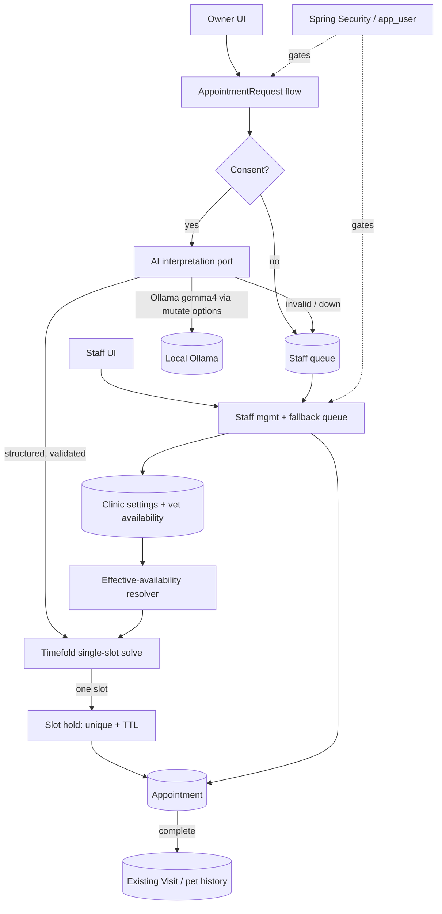

# Requirements

### Overview & Goals

Turn the grilled feature brief in `spec/proposal.md` into a formal **OpenSpec `spec-driven` change** named `smart-appointment-scheduling`. The change captures the *entire* feature at the proposal/specs/design level, while `tasks.md` is scoped to the **walking-skeleton foundation slice** only (per your "Full spec now, slice-1 tasks" choice).

The feature itself lets pet **owners** request appointments in free text; AI turns that into a structured interpretation; **Timefold** finds **one** suitable slot at a time in a guided accept/reject loop protected by short-lived holds; **staff** manage the clinic and pick up anything the automated flow cannot handle. Because the base PetClinic is fully anonymous today, authentication and identity are introduced from scratch.

**Goal of this task:** produce reviewable, validatable OpenSpec artifacts — not feature code. Implementation happens later via the apply workflow.

### Scope

**In scope (of the change artifacts)**
- One OpenSpec change (`spec-driven`: `proposal` → `specs` → `design` → `tasks`).
- Six capability spec deltas, split **by subsystem**: `security`, `calendar`, `appointment`, `scheduling/interpretation`, `scheduling/solver`, `staff`.
- `specs` + `design` cover the **full** feature; `tasks.md` covers **slice 1** only.
- Concrete defaults baked into the spec (grid, hold TTL, horizon, duration bounds, day-parts, cancel window, consent record, hold sweep, AI language).
- Corrections to the proposal's "Technical details" (Spring AI, Flyway starter, Ollama config, Timefold version).

**Out of scope**
- Writing any feature/production Java, Thymeleaf, or migration code (that is the later apply phase).
- Owner self-registration, password recovery, exposing the full calendar to owners, external notifications, multiple clinics, waitlists (out of scope of the feature itself).
- `notification` package — remains empty (notifications are out of feature scope).

### User Stories

- As an **owner**, I want to describe when I can/can't come in plain language so I don't have to hunt through a calendar.
- As an **owner**, I want to be offered one slot at a time and accept or ask for another, so I'm guided to a good appointment without seeing the whole calendar.
- As an **owner**, I want to explicitly consent before my text is sent to AI, and review/correct the interpretation before anything is scheduled.
- As an **owner**, I want to view and cancel my own upcoming appointments, but never see others'.
- As **staff**, I want a fallback queue so no owner is ever dead-ended when AI/solver fail, consent is declined, or no vet has the needed specialty.
- As **staff**, I want to configure clinic settings and per-vet availability, and book/reschedule/cancel/complete/no-show appointments directly.
- As **staff**, I want suspected emergencies flagged and prioritized, with urgent-care guidance always visible to owners.

### Functional Requirements (by subsystem)

**security** — dedicated `app_user` (username, password hash, role `OWNER|STAFF`, `enabled`, `mustChangePassword`) backing one `UserDetailsService`; OWNER links to exactly one `Owner`, STAFF links to none. All existing controllers secured; only login/error/static assets + static urgent-care guidance stay anonymous. Staff "act on behalf" via `ownerId`-scoped screens (no credential impersonation). Owner accounts are staff-provisioned with forced first-login password change; staff can reset passwords. Demo seeding: sample owners get username = lowercase first name (`George`→`george`), password `<username>123`, and demo accounts **skip** the forced change; a seeded staff/admin account is also created.

**calendar** — clinic settings (visit-duration bounds, booking horizon, hold duration, start-time grid granularity, named day-parts) with sensible defaults; per-vet recurring weekly schedule with split shifts, date-specific exceptions, and leave; clinic-wide closures; single configured time zone (`Europe/Amsterdam` default).

**appointment** — first-class `AppointmentRequest` with an explicit state machine; guided one-slot-at-a-time suggestions; short-lived `(vet,start)` holds with mutual exclusion; accept/reject/ask-again; `Appointment` entity (future slot) distinct from the existing `Visit`; owner self-service view/cancel of own upcoming appointments.

**scheduling/interpretation** — explicit consent gate before any AI call; strict typed structured interpretation (care type, duration, preferred/allowed/excluded windows, optional preferred vet, urgency); server-side validation/clamping and day-part/time-zone normalization; owner may edit structured fields without re-consent; revising free text requires fresh consent + fresh interpretation; validation/AI failure routes to the staff queue.

**scheduling/solver** — per-request single-slot Timefold solve over a fixed start-time grid; hard feasibility (inside effective availability, no overlap with appointments/active holds, not excluded, not a previously rejected `(vet,start)` pair, specialty match when needed); ordered soft score (preferred window > allowed, preferred-vet soft bonus, sooner-is-better) with deterministic `(vet id, start instant)` tie-break so "ask again" provably progresses and terminates.

**staff** — fallback queue fed by AI/solver-unavailable, declined-consent, incomplete-interpretation, and no-specialty triggers; staff-unblock-then-owner-resumes flow (holds stay short, no notification needed); direct book/reschedule/cancel with recorded reason; complete (→ records a `Visit`) / no-show lifecycle; emergency prioritization with **advisory-only** AI urgency and **unconditional** static urgent-care guidance.

### Non-Functional Requirements

- **Concurrency correctness** — two simultaneous owners must never be offered/confirm the same `(vet,start)`; enforced by a DB unique constraint + TTL, no long-held locks.
- **Determinism/testability** — suggestion ranking and the effective-availability resolver must be deterministic and unit-testable.
- **Offline-friendly** — LLM is a local Ollama model; budget for its size/latency; per-call timeouts/retries.
- **Compatibility** — existing owner/pet/vet/visit pages and the pet-history UI keep working; dual Maven+Gradle build stays green; H2/MySQL/Postgres all supported.
- **Safety** — urgent-care guidance can never be hidden by a model miss.

# Technical Design

### Current Implementation

- **Base app**: Spring Boot `4.1.0` / Java 17, server-rendered Thymeleaf + Spring MVC + Spring Data JPA. Domain under `org.springframework.samples.petclinic`: `owner/` (`Owner`, `Pet`, `Visit` = date+description on a Pet, `Owner/Pet/VisitController`), `vet/` (`Vet`, `Specialty`), `system/` (`WelcomeController`, `CrashController`, `WebConfiguration`, `CacheConfiguration`).
- **No authentication at all**; `Owner` has no credentials; Spring Security is not a dependency.
- **Empty scaffolding packages already present**: `appointment/`, `scheduling/interpretation/`, `scheduling/solver/`, `calendar/`, `security/`, `notification/` (all empty).
- **Schema** currently via `spring.sql.init` per-vendor scripts under `db/{h2,mysql,postgres}`; runtime drivers for H2, MySQL, Postgres.
- **Build**: both `pom.xml` (Boot 4.1.0 parent, checkstyle, spring-format, jacoco) and `build.gradle` + wrapper. None of Timefold / Spring AI / Ollama / Flyway / Spring Security declared yet.

### Key Decisions (locked during the grill)

1. **Solver unit** — per-request *single-slot* solve; existing appointments + active holds are immovable facts.
2. **Candidate space** — fixed configurable **start-time grid**; a start is valid only if the full visit duration fits one continuous availability block with no overlap.
3. **Ranking** — hard feasibility + ordered soft score + deterministic `(vet id, start instant)` tie-break; rejected `(vet,start)` pairs permanently excluded → provably progresses/terminates.
4. **Holds** — persisted `(vet,start)` rows guarded by a **unique constraint + TTL**; atomic INSERT, lose-the-race → re-solve; accept = transactional hold→appointment with revalidation.
5. **Hold-expiry UX** — on Accept re-validate in-transaction: still-free → re-acquire + confirm; taken → show "no longer available" and auto-offer the next slot (never dead-end).
6. **Request lifecycle** — first-class `AppointmentRequest` state machine (`DRAFT → AWAITING_CONSENT → INTERPRETED → CONFIRMED → SUGGESTING/HELD → SCHEDULED | QUEUED_FOR_STAFF | CANCELLED | EXPIRED`); child rejected-suggestion rows; links to active hold + resulting appointment; every action is a guarded transition.
7. **Interpretation contract** — strict typed schema via Spring AI structured output; server-side validate/clamp + day-part/time-zone normalization; failure → staff queue.
8. **Interpretation editing** — owner edits structured fields without re-consent; consent gates AI calls only.
9. **Emergencies** — AI urgency advisory only; static urgent-care guidance unconditional.
10. **Staff fallback** — staff unblock → owner resumes guided flow in-app (short holds, no notification); escape hatch = staff book directly for the unsolvable no-specialty case, with recorded reason.
11. **Identity** — dedicated `app_user` + nullable `Owner` link; one `UserDetailsService`; secure existing controllers; act-on-behalf via `ownerId`-scoped screens.
12. **Demo seeding** — sample owners → `firstname`/`firstname123`, no forced change; seeded staff/admin account too.
13. **Availability** — normalized recurring shift rows (split shifts = extra rows) + date exceptions + leave + closures, layered into effective free intervals at solve time by a dedicated **effective-availability resolver** (heavily unit-tested).
14. **Time** — store UTC instants; define shifts/grid/day-parts in the clinic `ZoneId`; convert at a single DST-aware boundary.
15. **Appointment vs Visit** — separate `Appointment`; completion creates a normal `Visit` (optionally back-linked); existing pet-history UI untouched.
16. **Spring AI** — Boot 4 + **Spring AI `2.0.1` GA** from Maven Central (no milestone repo); wrap the AI call behind our own interface.
17. **Ollama options trap** — model via `spring.ai.ollama.chat.model` (default `gemma4:latest`); per-call options **only** via `mutate()` from the auto-configured defaults (never build `OllamaChatOptions` from scratch, or the global model is wiped) to add temperature=0/structured-format/timeout/retries.
18. **Migrations** — **Flyway via `spring-boot-starter-flyway`** (+ `flyway-database-postgresql` + `flyway-mysql`, Boot-managed `12.4.0`); base tables folded into a V1 baseline, `spring.sql.init` disabled; **all three vendors** maintained (full parity).
19. **Build tool** — `pom.xml` canonical; mirror coordinates into `build.gradle`.
20. **Delivery** — sequential slices, walking-skeleton first (foundation → solver+holds → AI → staff/lifecycle).

### Proposed Changes (in the OpenSpec change)

- `proposal.md` — why/what/scope, actors, corrected technical details, delivery-slicing rationale, defaults summary.
- `specs/<subsystem>/spec.md` ×6 — full-feature requirement deltas with `#### Scenario:` blocks (see File Structure).
- `design.md` — the how: the 20 decisions, data model, state machine, architecture diagram, DST/hold/ranking algorithms, dependency & config plan, and an explicit note on the full-spec/slice-1-tasks deviation.
- `tasks.md` — **slice 1 only** implementation checklist.

### Data Models / Contracts (documented in design.md)

- `app_user(id, username ◇unique, password_hash, role, enabled, must_change_password, owner_id ◇nullable FK)`.
- `clinic_settings(grid_granularity_min, hold_duration_min, booking_horizon_days, min/max/default_visit_min, zone_id, day_parts...)`.
- `vet_weekly_shift(vet_id, day_of_week, start_local, end_local)` (split shift = multiple rows); `vet_availability_exception(vet_id, date, type, start_local, end_local)`; `vet_leave(vet_id, from_date, to_date)`; `clinic_closure(date/range)`.
- `appointment_request(id, owner_id, pet_id, free_text, status, consent_flag, consent_at, consent_text_snapshot, interpretation_json, resulting_appointment_id, active_hold_id)`; `rejected_suggestion(request_id, vet_id, start_instant)`.
- `appointment(id, request_id ◇nullable, pet_id, vet_id, start_instant, duration_min, status, reason)`; `slot_hold(id, vet_id, start_instant ◇unique(vet_id,start_instant), request_id, expires_at)`.
- Interpretation schema (Spring AI structured output): `careType`, `specialty?`, `estimatedDurationMin` (clamped), `preferred[]/allowed[]/excluded[]` windows (day-of-week + day-part or explicit ranges, clinic-zone), `preferredVet?`, `urgency`.

### Architecture Diagram



### File Structure (OpenSpec change artifacts)

```
openspec/changes/smart-appointment-scheduling/
  proposal.md
  design.md
  tasks.md
  specs/
    security/spec.md              # identity, roles, provisioning, demo seeding, securing existing controllers
    calendar/spec.md              # clinic settings, vet availability, closures, single time zone
    appointment/spec.md           # request lifecycle, guided suggestions, holds, appointment<->visit, owner cancel
    scheduling/interpretation/spec.md  # consent, structured interpretation, validation, editing
    scheduling/solver/spec.md     # grid, single-slot solve, ranking, feasibility, termination
    staff/spec.md                 # fallback queue, staff-assisted resume, direct mgmt, emergencies
```
(Exact `changeRoot`/`artifactPaths` come from `openspec status --change ... --json`.)

### Risks

- **Full-spec / slice-1-tasks deviation** — OpenSpec's apply/archive folds spec deltas into the main specs when tasks complete. Since `tasks.md` only covers slice 1, design.md must state the intent (specs describe target behavior; implementation is incremental) and note the change should **not be archived** until later slices land, or later slices spin off their own changes. Flagged for validation.
- **Timefold version** — proposal's `2.5.0` still unconfirmed; design.md will pin an actually-released Timefold 2.x and its Boot-4 starter, and note 2.x removed classic `VariableListener`s/chained vars (not needed for single-slot solve).
- **Local LLM flakiness/latency** — mitigated by strict schema + validation + staff fallback + `mutate()` options with timeout/retries.
- **Triple-vendor Flyway upkeep** — accepted maintenance cost of full parity.

# OpenSpec Change

### Change identity

- **Name:** `smart-appointment-scheduling` (kebab-case).
- **Schema:** `spec-driven` (from `openspec/config.yaml`) — artifacts in order `proposal → specs → design → tasks`.
- **CLI:** OpenSpec `1.9.0`; root resolves to the repo (no external store). Created via `openspec new change "smart-appointment-scheduling"`.

### Artifact plan (your "Full spec now, slice-1 tasks" choice)

| Artifact | Coverage |
|---|---|
| `proposal.md` | Full feature: why/what/scope, corrected tech details, slicing rationale, defaults |
| `specs/**` (6 files) | **Full feature** requirement deltas, split by subsystem |
| `design.md` | **Full feature** how: 20 decisions, data model, state machine, algorithms, deps/config |
| `tasks.md` | **Slice 1 (foundation) only** implementation checklist |

### Capability layout (by subsystem)

Mirrors the empty package scaffolding: `security`, `calendar`, `appointment`, `scheduling/interpretation`, `scheduling/solver`, `staff`. `notification` intentionally omitted (out of scope). Each `spec.md` uses OpenSpec `### Requirement` + `#### Scenario:` (Given/When/Then) blocks so `openspec validate` passes.

### Confirmed defaults (baked into `calendar`/`appointment` specs)

| Setting | Default |
|---|---|
| Start-time grid granularity | 15 min |
| Hold TTL | 10 min |
| Booking horizon | 60 days ahead |
| Visit duration bounds | 15–120 min (default 30) |
| Day-parts | morning 08:00–12:00, afternoon 12:00–17:00, evening 17:00–20:00 |
| Owner self-cancel window | up to 24h before start |
| Consent record | per-request boolean + timestamp + snapshot of consented text |
| Expired-hold cleanup | scheduled sweep every 5 min + lazy-on-read |
| AI language | English-only for now |
| Clinic time zone | `Europe/Amsterdam` |

### Corrections to the proposal's "Technical details"

- **Spring AI** — `2.0.1` is **correct/GA on Maven Central** (targets Boot 4); no milestone repo. Wrap AI behind our own port.
- **Flyway** — use `spring-boot-starter-flyway` (+ `flyway-database-postgresql`, `flyway-mysql`), Boot-managed `12.4.0`; disable `spring.sql.init`; V1 baseline; all three vendors.
- **Ollama** — `gemma4:latest` valid; model via `spring.ai.ollama.chat.model`; per-call options via `mutate()` only.
- **Timefold** — re-pin `2.5.0` to an actually-released 2.x + confirm its Boot-4 starter (design.md).
- **Build** — add deps to `pom.xml` first, mirror into `build.gradle`.

### Slice 1 (foundation) — what `tasks.md` will cover

Spring Security identity (`app_user`, `UserDetailsService`, secure existing controllers) + demo seeding; core entities (`AppointmentRequest`, `Appointment`, `ClinicSettings`, vet availability) via Flyway V1 baseline; the effective-availability resolver + fixed start-time grid; **staff booking directly against the grid** (no Timefold, no AI yet) — a working end-to-end vertical. Slices 2–4 (solver+holds, AI+consent, staff fallback+lifecycle) are documented in specs/design and deferred to future changes/tasks.

# Testing

### Validation Approach

This task produces planning artifacts, so validation is about artifact correctness and internal consistency — not running feature code.

- Run `openspec validate --change smart-appointment-scheduling` (and `openspec status --change ... --json`) until all required artifacts (`proposal`, `specs`, `design`, `tasks`) are `done` and the change validates cleanly.
- Confirm each of the six capability `spec.md` files uses well-formed `### Requirement` / `#### Scenario:` (Given/When/Then) structure the validator accepts.
- Cross-check consistency: every subsystem in Requirements/Technical Design maps to exactly one capability spec; every locked decision appears in `design.md`; every slice-1 item in `tasks.md` traces back to a spec requirement.

### Key Scenarios (encoded as spec scenarios)

- Owner free-text → consent → interpretation → one suggested slot → accept confirms appointment.
- Owner rejects → that exact `(vet,start)` never reappears; "ask again" yields a strictly progressing next slot.
- Two owners target the same slot → unique-constraint hold ensures only one wins; loser auto-advances.
- Hold expires before Accept → still-free re-acquire vs taken → auto-offer next (never dead-end).
- Declined consent / AI down / invalid interpretation / no specialty → request enters staff queue; staff unblock → owner resumes.
- Appointment completed → a `Visit` row appears in existing pet history.
- Anonymous access to any secured page → redirected to login; urgent-care guidance still reachable.

### Edge Cases

- DST boundary (late Mar / late Oct) inside the booking horizon — resolver handles gap/overlap at the single conversion boundary.
- Variable visit length that cannot fit any continuous availability block → no feasible slot → staff queue, not a bare error.
- Preferred vet unset or repeatedly unavailable → soft bonus only, never a dead-end.
- Demo-seeded accounts skip forced password change; staff-provisioned owners are forced to change on first login.

### Test Changes

- `tasks.md` (slice 1) will call out unit tests for the **effective-availability resolver** (the trickiest pure logic) and the **deterministic ranking/tie-break**, plus Spring Security access-control tests for the newly secured existing controllers.

# Delivery Steps

### ✓ Step 1: Scaffold the change and author the proposal artifact
The `smart-appointment-scheduling` OpenSpec change exists with a complete `proposal.md`.

- Run `openspec new change "smart-appointment-scheduling"` (spec-driven schema) and read back `openspec status --change smart-appointment-scheduling --json` to capture `changeRoot`, `artifactPaths`, and the build order.
- Fetch `openspec instructions proposal --change ... --json` and follow its template.
- Write `proposal.md` covering the full feature: purpose, actors (owner/staff), in/out-of-scope, and the delivery-slicing rationale (walking-skeleton first).
- Fold in the corrected "Technical details": Spring AI `2.0.1` GA, `spring-boot-starter-flyway` (+ postgres/mysql modules) with `spring.sql.init` disabled, Ollama model via `spring.ai.ollama.chat.model` with `mutate()`-only options, Timefold re-pin note, Maven-canonical build.
- Summarize the confirmed defaults table (grid 15 min, hold TTL 10 min, horizon 60 days, duration 15–120/30, day-parts, 24h cancel, consent record, hold sweep, English-only, Europe/Amsterdam).

### ✓ Step 2: Author foundation capability specs (security, calendar, appointment)
`specs/security/spec.md`, `specs/calendar/spec.md`, and `specs/appointment/spec.md` exist as full-feature requirement deltas with valid scenarios.

- `security` — `app_user` model + roles (`OWNER|STAFF`), nullable `Owner` link, single `UserDetailsService`, securing all existing controllers while leaving login/error/static + urgent-care guidance anonymous, staff act-on-behalf via `ownerId`-scoped screens, staff-provisioned accounts with forced first-login change and reset, and demo seeding (`firstname`/`firstname123`, no forced change, seeded staff/admin).
- `calendar` — clinic settings with the confirmed defaults, per-vet recurring weekly schedule with split shifts, date-specific exceptions, per-vet leave, clinic-wide closures, and the single configured time zone with UTC storage + clinic-zone reasoning.
- `appointment` — `AppointmentRequest` state machine, guided one-slot-at-a-time suggestions, `(vet,start)` holds (unique constraint + TTL) with re-validate/auto-recover on accept, the `Appointment` entity distinct from `Visit`, completion creating a `Visit`, and owner self-service view/cancel (24h window).
- Use `### Requirement` + `#### Scenario:` (Given/When/Then) blocks so the validator passes.

### ✓ Step 3: Author smart-flow and staff capability specs (interpretation, solver, staff)
`specs/scheduling/interpretation/spec.md`, `specs/scheduling/solver/spec.md`, and `specs/staff/spec.md` exist as full-feature requirement deltas.

- `scheduling/interpretation` — explicit consent gate before any AI call, strict typed structured interpretation schema, server-side validation/clamping and day-part/time-zone normalization, owner editing of structured fields without re-consent (fresh text = fresh consent), and routing validation/AI failures to the staff queue.
- `scheduling/solver` — per-request single-slot Timefold solve over the fixed start-time grid, hard feasibility (availability/overlap/excluded/rejected-pair/specialty), ordered soft score (preferred>allowed window, preferred-vet bonus, sooner-is-better), deterministic `(vet id, start instant)` tie-break, and provable progression/termination via permanent rejected-pair exclusion.
- `staff` — fallback queue triggers (AI/solver down, declined consent, incomplete interpretation, no specialty), staff-unblock-then-owner-resumes flow, direct book/reschedule/cancel with recorded reason, complete/no-show lifecycle, and emergency handling (advisory-only AI urgency + unconditional static urgent-care guidance).
- Encode the key/edge scenarios from the Testing tab (double-booking race, hold-expiry recovery, DST boundary, no-fit → staff queue).

### ✓ Step 4: Author the design artifact
`design.md` captures the full-feature "how" and passes as a dependency for tasks.

- Fetch `openspec instructions design --change ... --json`, read the completed proposal + all six specs from disk first.
- Document all 20 locked decisions, the data model (tables/columns/constraints incl. the `slot_hold` unique index), and the `AppointmentRequest` state machine.
- Include the architecture diagram and the algorithms for the effective-availability resolver (with DST boundary handling), the deterministic ranking/tie-break, and the hold acquire/re-solve/accept transaction.
- Specify the dependency & config plan: Spring AI `2.0.1`, Flyway starter + vendor modules (V1 baseline, `spring.sql.init` off, all three vendors), Ollama `mutate()`-from-defaults options pattern behind our own AI port, Timefold 2.x pin + Boot-4 starter, and Maven-canonical/Gradle-mirror.
- Add an explicit note on the full-spec / slice-1-tasks deviation and its apply/archive implication (do not archive until later slices land, or spin them into future changes).

### ✓ Step 5: Author slice-1 tasks and validate the change
`tasks.md` scoped to the foundation slice exists and `openspec validate` passes for the whole change.

- Fetch `openspec instructions tasks --change ... --json` and read `design.md` + specs from disk.
- Write a slice-1-only implementation checklist: Spring Security identity (`app_user`, `UserDetailsService`, secure existing controllers) + demo seeding; core entities (`AppointmentRequest`, `Appointment`, `ClinicSettings`, vet availability) via a Flyway V1 baseline; the effective-availability resolver + fixed start-time grid; staff booking directly against the grid (no Timefold/AI); and mirroring new deps into `build.gradle`.
- Include slice-1 test tasks: unit tests for the effective-availability resolver and deterministic ranking scaffolding, plus Spring Security access-control tests for the newly secured controllers.
- Explicitly mark slices 2–4 as out-of-scope-for-now in `tasks.md`, pointing back to the specs/design.
- Run `openspec validate --change smart-appointment-scheduling` and `openspec status --change ... --json`; iterate until every required artifact is `done` and validation is clean.