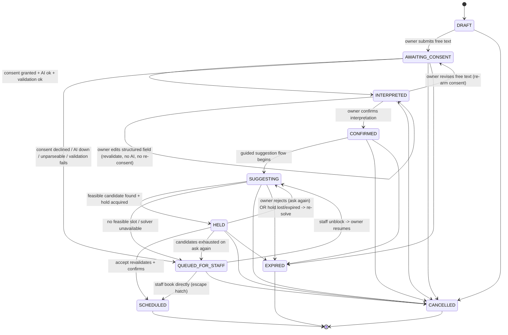
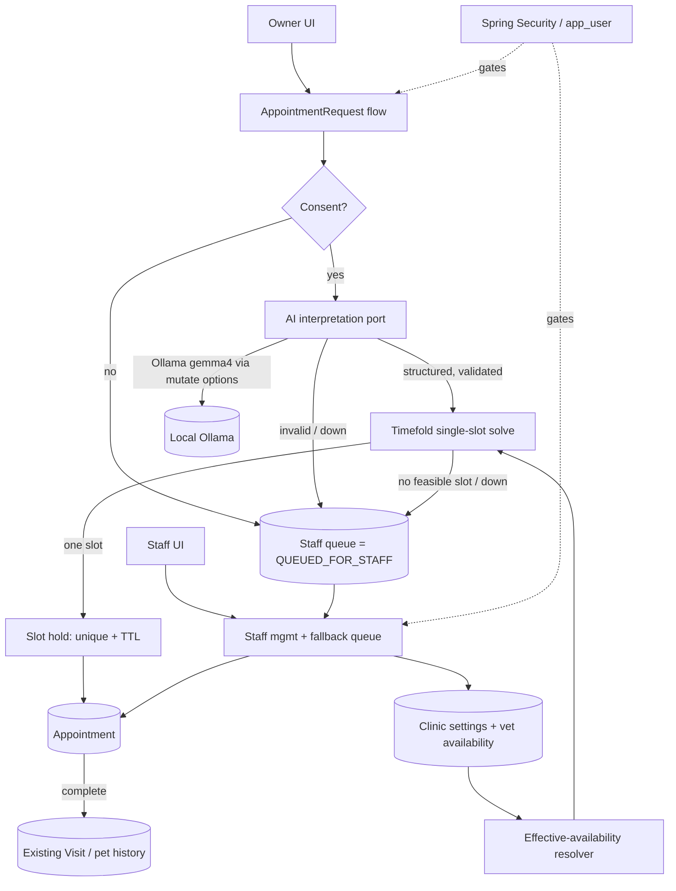

## Context

See `proposal.md` — Why / What Changes for the motivation and scope. This document covers **how** the full feature is built.

The base app is Spring PetClinic on **Spring Boot 4.1.0 / Java 17**, server-rendered (Thymeleaf + Spring MVC + Spring Data JPA), fully anonymous, with no appointment concept. The domain lives under `org.springframework.samples.petclinic`: `owner/` (`Owner`, `Pet`, `Visit` = date+description on a `Pet`), `vet/` (`Vet`, `Specialty`), `system/` (config + `WelcomeController` + `CrashController`). Empty scaffolding packages already exist for `security/`, `calendar/`, `appointment/`, `scheduling/interpretation/`, `scheduling/solver/`, `staff/`, and `notification/`. Schema is currently loaded per-vendor via `spring.sql.init` under `db/{h2,mysql,postgres}`; runtime drivers exist for H2, MySQL, and Postgres. The build is dual: `pom.xml` (Boot 4.1.0 parent, checkstyle, spring-format, jacoco) and `build.gradle` + wrapper. None of Spring Security, Spring AI, Timefold, or Flyway are declared yet.

Key constraints that shape the approach:

- **Concurrency correctness** — two simultaneous owners must never be offered or confirm the same `(vet, start)`; enforced by a DB unique constraint + short TTL, never a long-held lock.
- **Determinism / testability** — the suggestion ranking and the effective-availability resolver must be pure, deterministic, and unit-testable.
- **Offline-friendly** — the LLM is a local Ollama model with real size/latency budget; every AI call needs a timeout, retries, and a non-AI fallback.
- **Compatibility** — existing owner/pet/vet/visit pages and the pet-history UI must keep working; the dual Maven + Gradle build stays green; H2/MySQL/Postgres all remain supported.
- **Safety** — static urgent-care guidance can never be hidden by a model miss.

## Goals / Non-Goals

**Goals (design-level):**

- Give every capability spec (`security`, `calendar`, `appointment`, `scheduling/interpretation`, `scheduling/solver`, `staff`) a concrete, implementable data model, control flow, and dependency plan.
- Guarantee the three hardest invariants at the design level: **no double-booking** (unique-constraint hold + TTL), **provable "ask again" termination** (permanent rejected-pair exclusion), and **DST-correct availability** (single conversion boundary in the clinic zone).
- Pin exact, actually-released dependency coordinates that are compatible with Spring Boot 4, and record the traps (Ollama `mutate()`, Timefold Java baseline, Flyway `spring.sql.init` disable).
- Keep the LLM and the solver behind app-owned ports so the rest of the system does not depend on vendor APIs.

**Non-Goals (design-level):**

- No owner self-registration, password recovery, full-calendar exposure to owners, external notifications, multiple clinics, or waitlists (feature-level out of scope, per `proposal.md`).
- No `notification` package work — it stays empty.
- Design does not restate spec requirements; where a requirement is normative it is referenced (see `specs/<capability>/spec.md`). This document adds the *how*, not a second copy of the *what*.
- The `tasks.md` breakdown is **slice-1 only** (see "Full-spec / slice-1-tasks deviation" below); design describes the full target so later slices have a stable blueprint.

## Decisions

The twenty decisions locked during the grill, each with rationale and the alternative rejected.

### D1 — Solver unit: per-request single-slot solve

Solve for exactly one `(vet, start)` at a time for one request; all existing appointments and currently active holds are **immovable facts**. *Why:* the product is a guided one-at-a-time accept/reject loop, not a batch optimizer; treating the world as fixed keeps each solve tiny and side-effect free. *Alternative rejected:* a global multi-appointment optimizer — needless complexity, and it would fight the one-slot UX and the immovability of confirmed bookings. (`specs/scheduling/solver` — Per-request single-slot solve over a fixed grid.)

### D2 — Candidate space: fixed start-time grid + continuous-fit rule

Candidate starts are drawn from a fixed, configurable **start-time grid** (default 15 min). A start is valid only if the full visit duration fits inside **one continuous** effective-availability block with no overlap. *Why:* a discrete grid makes the candidate set finite, enumerable, and testable; the continuous-fit rule prevents a visit from straddling a break. *Alternative rejected:* continuous free-time placement — infinite candidate space, harder to reason about and to unit-test.

### D3 — Ranking: hard feasibility + ordered soft score + deterministic tie-break

Feasibility is a hard gate; feasible candidates are ranked by an ordered soft score (preferred window > allowed, preferred-vet soft bonus, sooner-is-better); ties break by ascending `(vet id, start instant)`. Rejected `(vet, start)` pairs are **permanently excluded**, so the candidate set strictly shrinks and the loop provably progresses/terminates. *Why:* determinism is required for testability and for a truthful "ask again" that never re-offers or loops forever. *Alternative rejected:* a stochastic or weighted-random pick — non-reproducible and untestable. (`specs/scheduling/solver` — Ordered soft-score ranking, Deterministic tie-break, Provable progression and termination.)

### D4 — Holds: persisted `(vet, start)` rows guarded by unique constraint + TTL

A hold is a `slot_hold` row with a **unique `(vet_id, start_instant)`** constraint and an `expires_at`. Acquisition is an atomic INSERT; losing the race (unique violation) triggers a re-solve. Accept is a transactional hold→appointment conversion with in-transaction revalidation. *Why:* the DB unique index is the single source of truth for mutual exclusion, needs no long-held lock, and works identically across H2/MySQL/Postgres. *Alternative rejected:* application-level locking or `SELECT … FOR UPDATE` held across the owner's think-time — long locks, deadlock risk, does not survive multiple nodes. (`specs/appointment` — Short-lived slot holds with mutual exclusion.)

### D5 — Hold-expiry UX: revalidate-then-recover on Accept

On Accept, revalidate the hold inside the transaction: still free → re-acquire + confirm; already taken → tell the owner "no longer available" and **auto-offer the next slot** — never a dead-end, never a raw error. *Why:* short TTLs mean holds can lapse during think-time; the owner should glide to the next option. *Alternative rejected:* fail the accept with an error the owner must recover from manually. (`specs/appointment` — Accept re-validates and auto-recovers.)

### D6 — Request lifecycle: first-class `AppointmentRequest` state machine

A first-class `AppointmentRequest` with the state machine `DRAFT → AWAITING_CONSENT → INTERPRETED → CONFIRMED → SUGGESTING/HELD → SCHEDULED | QUEUED_FOR_STAFF | CANCELLED | EXPIRED`, child `rejected_suggestion` rows, and links to the active hold and the resulting appointment. Every action is a **guarded transition**; undefined transitions are rejected. *Why:* the flow has many branch points (consent, edit, reject, hold loss, staff fallback) that are only safe as an explicit machine. *Alternative rejected:* boolean flags scattered across entities — unenforceable and untestable. (`specs/appointment` — Appointment request lifecycle. Full transition table below.)

### D7 — Interpretation contract: strict typed structured output

The AI returns a strict typed schema via Spring AI structured output; the server validates, clamps duration to configured bounds, and normalizes day-parts and windows to the clinic zone before anything reaches the solver. Any validation/AI failure routes to the staff queue. *Why:* a solver must never consume free text or unbounded values; strict typing + server validation is the contract boundary. *Alternative rejected:* free-text prompts parsed ad hoc downstream — brittle and unsafe. (`specs/scheduling/interpretation` — Strict typed structured interpretation; Server-side validation, clamping, and normalization.)

### D8 — Interpretation editing without re-consent

Owners edit structured fields (care type, duration, windows, preferred vet) directly with **no new AI call and no fresh consent**, because consent gates AI calls only; edits are re-validated/clamped server-side. Revising the **free text** does require fresh consent + a fresh interpretation. *Why:* consent is about "send my text to AI," not about correcting parsed fields; forcing re-consent on every edit would be user-hostile. *Alternative rejected:* re-consent on any change — conflates two different privacy events. (`specs/scheduling/interpretation` — Owner editing of structured fields without re-consent; Fresh free text requires fresh consent and interpretation.)

### D9 — Emergencies: advisory-only urgency, unconditional guidance

AI-derived urgency is **advisory only** (it may prioritize/rank in the staff queue but never schedules, rejects, or hides anything on its own); static urgent-care guidance is shown **unconditionally** and stays reachable without authentication. *Why:* safety must not depend on a model output that can miss. *Alternative rejected:* letting urgency gate or auto-route flows — a model miss could suppress safety guidance. (`specs/staff` — Emergency prioritization is advisory only; Urgent-care guidance is shown unconditionally.)

### D10 — Staff fallback: unblock-and-resume, with a direct-book escape hatch

Staff unblock a queued request and the owner **resumes the guided flow in-app** (holds are short, so no external notification is needed — resume relies on the owner returning). For the genuinely unsolvable case (e.g., a required specialty no vet has), staff **book directly** on the owner's behalf with a recorded reason. *Why:* keep the owner in the automated flow whenever possible; only drop to manual booking when automation truly cannot proceed. *Alternative rejected:* always hand off to manual once queued — abandons the guided UX unnecessarily. (`specs/staff` — Staff unblock then owner resumes; Staff direct booking, reschedule, and cancel.)

### D11 — Identity: dedicated `app_user` + nullable `Owner` link, one `UserDetailsService`

A dedicated `app_user` (username, password hash, role `OWNER|STAFF`, `enabled`, `mustChangePassword`) with a **nullable** one-to-one `Owner` link (`OWNER` → exactly one `Owner`; `STAFF` → none) backs a single `UserDetailsService`. All existing controllers are secured; act-on-behalf is via `ownerId`-scoped screens (no credential impersonation). *Why:* the domain `Owner` is not a credential holder; a separate identity keeps auth orthogonal and lets staff exist without an owner. *Alternative rejected:* bolting a password onto `Owner` — no staff identity, no clean role model. (`specs/security` — Application user identity; Roles and owner linkage; Existing controllers are secured; Staff act on behalf of owners.)

### D12 — Demo seeding

Sample owners get username = lowercase first name (`George` → `george`) with password `<username>123` and **skip** the forced first-login change; a seeded staff/admin account is also created. *Why:* frictionless demos, while real staff-provisioned owners are still forced to change on first login. *Alternative rejected:* forcing password change on demo accounts — defeats a smooth demo. (`specs/security` — Demo account seeding.)

### D13 — Availability: normalized rows layered by an effective-availability resolver

Availability is normalized rows — recurring weekly shifts (split shift = multiple rows), date-specific exceptions, per-vet leave, clinic-wide closures — layered into effective free intervals at solve time by a dedicated, heavily unit-tested **effective-availability resolver**. *Why:* a single deterministic resolver is the only place that composes the layers, so its rules can be exhaustively tested (including DST). *Alternative rejected:* materializing per-day availability rows — write amplification, drift, and DST re-materialization headaches. (`specs/calendar`. Algorithm below.)

### D14 — Time: store UTC instants, reason in the clinic zone, convert once

Persist UTC `Instant`s; define shifts, grid, and day-parts in the clinic `ZoneId`; convert at a **single DST-aware boundary** (the resolver). *Why:* UTC storage is unambiguous; a single conversion point means DST is handled in exactly one tested place. *Alternative rejected:* storing local times or converting in many places — DST bugs scattered everywhere. (`specs/calendar` — Single configured time zone.)

### D15 — Appointment vs Visit: separate entity, completion creates a Visit

A new `Appointment` (future slot) is distinct from the existing `Visit` (past, completed event on a `Pet`); completing an appointment records a normal `Visit` (optionally back-linked). The existing pet-history UI is untouched. *Why:* the two have different lifecycles and semantics; reusing `Visit` for future slots would corrupt history. *Alternative rejected:* overloading `Visit` with a future/past flag — breaks the existing history UI and reporting. (`specs/appointment` — Appointment entity distinct from visit; Completion records a visit.)

### D16 — Spring AI 2.0.1 GA, wrapped behind an app-owned port

Use **Spring AI 2.0.1 GA** from Maven Central (targets Boot 4; **no** milestone repository). Wrap the AI call behind our own `AppointmentInterpreter` port so the rest of the app never touches vendor types. *Why:* GA + Maven-Central-only keeps the build reproducible; the port isolates us from Spring AI API churn (2.0 was a breaking reorg of 1.x). *Alternative rejected:* calling `ChatClient`/Ollama types directly across services — vendor lock-in and painful upgrades. (Dependency plan below.)

### D17 — Ollama options: model via property, per-call options **only** via `mutate()`

Set the model via `spring.ai.ollama.chat.model` (default `gemma4:latest`). Apply per-call options (temperature 0, structured/JSON format, timeout, retries) **only** by calling `.mutate()` on the auto-configured default `OllamaChatOptions` — **never** by constructing `OllamaChatOptions` from scratch, which wipes the globally configured model. *Why:* this is a real, easy-to-hit trap; a from-scratch options object silently drops the model name. *Alternative rejected:* building options fresh per call — the documented footgun. (Config plan below.)

### D18 — Migrations: Flyway with a V1 baseline, `spring.sql.init` off, triple-vendor parity

Use `spring-boot-starter-flyway` plus `flyway-database-postgresql` and `flyway-mysql` (Boot-managed 12.4.0). Fold the current per-vendor `spring.sql.init` scripts into a **V1 baseline**, disable `spring.sql.init`, and maintain **all three vendors** (H2/MySQL/Postgres) at full parity. *Why:* versioned, repeatable, cross-vendor migrations replace fragile init scripts; Flyway is the standard. *Alternative rejected:* keeping `spring.sql.init` — no versioning, no repeatable migrations, and it would race with Flyway if both ran. (Migration Plan below.)

### D19 — Build: `pom.xml` canonical, mirror into `build.gradle`

Add every new coordinate to `pom.xml` first (canonical), then mirror the same coordinates/versions into `build.gradle`. *Why:* one source of truth avoids drift; the dual build must stay green. *Alternative rejected:* dropping one build tool — the repo deliberately ships both.

### D20 — Delivery: sequential slices, walking-skeleton first

Deliver in sequential slices, thinnest end-to-end vertical first: **(1) foundation** (security + seeding, core entities via Flyway V1, resolver + grid, staff booking directly against the grid — no Timefold/AI) → **(2) solver + holds** → **(3) AI + consent** → **(4) staff fallback + lifecycle**. *Why:* each slice is independently reviewable and keeps the app runnable. *Alternative rejected:* big-bang delivery — unreviewable and un-runnable mid-flight. This drives the full-spec / slice-1-tasks deviation (below).

## Data Model

New tables (all instants stored as UTC; local wall-clock fields are `LocalTime`/`LocalDate` interpreted in the clinic `ZoneId`). `◇` marks a nullable column; `⊤` marks a unique constraint.

### security

- **`app_user`** — `id` PK; `username` `⊤`; `password_hash`; `role` (`OWNER|STAFF`); `enabled` (bool); `must_change_password` (bool); `owner_id` `◇` FK → `owners(id)` (set for `OWNER`, null for `STAFF`).

### calendar

- **`clinic_settings`** — singleton row: `grid_granularity_min` (default 15); `hold_duration_min` (default 10); `booking_horizon_days` (default 60); `min_visit_min` (15); `max_visit_min` (120); `default_visit_min` (30); `zone_id` (default `Europe/Amsterdam`); day-part definitions `morning_start/morning_end/afternoon_start/afternoon_end/evening_start/evening_end` (defaults 08:00/12:00/12:00/17:00/17:00/20:00), stored as `LocalTime`.
- **`vet_weekly_shift`** — `id` PK; `vet_id` FK → `vets(id)`; `day_of_week` (1–7); `start_local` (`LocalTime`); `end_local` (`LocalTime`). A split shift is simply **multiple rows** for the same vet+day.
- **`vet_availability_exception`** — `id` PK; `vet_id` FK; `date` (`LocalDate`); `type` (`ADD | REMOVE | REPLACE`); `start_local` `◇`; `end_local` `◇`.
- **`vet_leave`** — `id` PK; `vet_id` FK; `from_date` (`LocalDate`); `to_date` (`LocalDate`).
- **`clinic_closure`** — `id` PK; `from_date` (`LocalDate`); `to_date` (`LocalDate`) (a single-day closure uses `from_date == to_date`).

### appointment

- **`appointment_request`** — `id` PK; `owner_id` FK; `pet_id` FK; `free_text`; `status` (the state-machine state); `consent_flag` (bool); `consent_at` `◇` (timestamp); `consent_text_snapshot` `◇` (exact consented text); `interpretation_json` `◇`; `resulting_appointment_id` `◇` FK → `appointment(id)`; `active_hold_id` `◇` FK → `slot_hold(id)`.
- **`rejected_suggestion`** — `id` PK; `request_id` FK → `appointment_request(id)`; `vet_id` FK; `start_instant` (UTC). Child rows recording every rejected `(vet, start)` for the request; the permanent-exclusion set.
- **`appointment`** — `id` PK; `request_id` `◇` FK → `appointment_request(id)` (null for pure staff-direct bookings); `pet_id` FK; `vet_id` FK; `start_instant` (UTC); `duration_min`; `status` (`SCHEDULED | COMPLETED | NO_SHOW | CANCELLED`); `reason` `◇` (recorded on staff cancel/reschedule).
- **`slot_hold`** — `id` PK; `vet_id` FK; `start_instant` (UTC); `request_id` FK; `expires_at` (UTC). **Unique constraint `⊤ (vet_id, start_instant)`** — the double-booking guard. Only rows with `expires_at > now` are treated as active; expired rows are swept and ignored on read.

### Interpretation schema (Spring AI structured output → `interpretation_json`)

- `careType` (string/enum), `specialty` `◇` (required specialty), `estimatedDurationMin` (clamped to `[min_visit_min, max_visit_min]`), `preferred[] / allowed[] / excluded[]` windows (each a day-of-week + named day-part, or an explicit local time range, in the clinic zone), `preferredVet` `◇`, `urgency` (advisory-only enum).

## AppointmentRequest State Machine

`QUEUED_FOR_STAFF` **is** the staff fallback queue (`specs/staff` — Staff fallback queue): a request in this state is exactly one item on that queue, tagged with the trigger reason.

Rules: every action is a **guarded transition**; a transition not defined for the current state is rejected and leaves the state unchanged (`specs/appointment` — Undefined transition is rejected). The `Appointment` created on `SCHEDULED` has its own lifecycle (`COMPLETED` → records a `Visit`; `NO_SHOW`; `CANCELLED`), owned by staff (`specs/staff` — Appointment completion and no-show lifecycle).

## Architecture

Package mapping: `security/` (identity + `UserDetailsService` + config), `calendar/` (settings, availability rows, resolver), `appointment/` (request state machine, holds, `Appointment`, owner self-service), `scheduling/interpretation/` (consent gate + `AppointmentInterpreter` port + validation/normalization), `scheduling/solver/` (Timefold planning model + constraints + ranking), `staff/` (fallback queue + direct management + lifecycle + emergencies). `notification/` stays empty.

## Algorithm: Effective-Availability Resolver (with DST handling)

Pure function `resolve(vetId, date, clinicSettings) -> List<Instant interval>` (deterministic, no I/O beyond the passed-in rows). It is the **single DST-aware conversion boundary** (D14).

1. **Closure check (highest precedence).** If a `clinic_closure` covers `date`, return `[]` (empty). (`specs/calendar` — Clinic-wide closures.)
2. **Leave check.** If a `vet_leave` range covers `date` for this vet, return `[]`. (`specs/calendar` — Per-veterinarian leave.)
3. **Base local intervals.** If any `vet_availability_exception` of type `REPLACE`/`REMOVE` applies to `date`, the exception defines the day (a `REMOVE` with no range clears it); otherwise take the `vet_weekly_shift` rows for `date`'s day-of-week (split shifts = several local intervals). Then apply `ADD` exceptions by unioning their local intervals. Exceptions take precedence over the recurring schedule for that date. (`specs/calendar` — Date-specific availability exceptions.)
4. **Local → instant conversion (the DST boundary).** For each local interval `[start_local, end_local]` on `date`, build `ZonedDateTime` at the clinic `ZoneId` and take `.toInstant()` for both ends:
   - **Spring-forward gap** (a wall-clock time that does not exist): `ZonedDateTime` normalizes the nonexistent local time forward by the offset shift, so the interval stays continuous in instant space (no phantom availability inside the gap).
   - **Fall-back overlap** (a wall-clock time that occurs twice): resolve with the zone's earlier-then-later offset transition so the interval spans the real elapsed instants without duplication.
   - Net effect: on DST days the *elapsed instant length* of a fixed local block legitimately grows or shrinks by one hour, and availability remains correct and continuous. (`specs/calendar` — Daylight-saving transition is handled at the conversion boundary.)
5. **Merge + sort.** Merge overlapping/adjacent instant intervals and sort ascending for a canonical, deterministic result.

The resolver returns **effective working intervals**; overlap with existing appointments and active holds is applied later, as a hard constraint in the solver (D2/D3), keeping the resolver a pure function of the calendar rows.

## Algorithm: Deterministic Ranking / Tie-Break

Given a `CONFIRMED` request with a validated interpretation:

1. **Enumerate candidates.** For each eligible vet and each grid start within the booking horizon that lies inside a resolved availability interval, form candidate `(vet, start)`.
2. **Hard filter (feasibility).** Keep a candidate only if: the full `[start, start + duration]` fits **one continuous** availability block; it does not overlap any existing appointment or **active** hold; `start` is not inside an `excluded` window; `(vet, start)` is **not** in `rejected_suggestion` for this request; and, if the interpretation requires a `specialty`, the vet has it. (`specs/scheduling/solver` — Hard feasibility constraints.)
3. **Ordered soft score** (lexicographic, higher is better):
   - **Tier 1 — window:** `start` inside a `preferred` window = 2; inside `allowed` only = 1.
   - **Tier 2 — preferred-vet bonus:** vet matches interpretation's `preferredVet` = 1, else 0 (soft only; never a gate — a request is never infeasible just because the preferred vet has no slot).
   - **Tier 3 — sooner-is-better:** earlier `start` ranks higher.
4. **Deterministic tie-break.** For otherwise-equal candidates, order by **ascending `vet id`, then ascending `start instant`**. The same `(request, calendar, rejections)` inputs always yield the identical top slot. (`specs/scheduling/solver` — Deterministic tie-break; Ordered soft-score ranking.)
5. **Return** the single top-ranked candidate, or a definite **no-feasible-slot** outcome (routes to `QUEUED_FOR_STAFF`, not an error).

**Termination proof (informal).** Every reject adds a `rejected_suggestion` row that is permanently excluded in step 2, so the feasible set strictly shrinks with each "ask again." From a finite grid over a finite horizon, the set is finite; therefore the loop either returns a new slot or, once exhausted, reports no feasible slot — it can never re-offer a rejected pair or loop forever. (`specs/scheduling/solver` — Provable progression and termination.)

## Algorithm: Hold Acquire / Lose-the-Race / Accept Transaction

**Suggest (offer one slot).** The solver returns the top `(vet, start)`. Attempt an **atomic INSERT** into `slot_hold(vet_id, start_instant, request_id, expires_at = now + hold_duration)`.
- **Success** → set `appointment_request.active_hold_id`, transition `SUGGESTING → HELD`, show the one slot to the owner.
- **Unique violation (lost the race)** → another owner holds it; treat that `(vet, start)` as occupied and immediately **re-solve** (its active hold already makes it infeasible via step 2 above) to offer the next slot. The owner never sees the collision. (`specs/appointment` — Two owners cannot hold the same slot.)

**Reject / ask again.** Insert a `rejected_suggestion(request_id, vet, start)` row, delete the current hold, re-solve, and offer the next slot (or route to `QUEUED_FOR_STAFF` if exhausted).

**Accept (single transaction).**
1. `BEGIN`.
2. Re-read the hold for `(request, vet, start)`.
3. **Hold still valid** (`expires_at > now`) → create the `Appointment`, delete the hold, set `resulting_appointment_id`, transition `HELD → SCHEDULED`. `COMMIT`.
4. **Hold expired/gone** → revalidate the raw slot: is `(vet, start)` still free (no overlapping appointment and no other active hold)?
   - **Still free** → re-acquire the hold via atomic INSERT, then confirm as in step 3.
   - **Taken** → do **not** error: report "no longer available," re-solve, and **auto-offer the next slot** (transition back toward `SUGGESTING`/`HELD`). `COMMIT` with no appointment. (`specs/appointment` — Accept re-validates and auto-recovers.)

**Expiry cleanup.** A scheduled sweep runs **every 5 minutes** to delete rows with `expires_at <= now`; additionally, reads treat expired holds as absent (**lazy-on-read**), so an expired hold never blocks a slot even between sweeps. (`specs/appointment` — Expired holds are cleaned up.)

## Dependency & Config Plan

`pom.xml` is canonical (D19); mirror identical coordinates/versions into `build.gradle`.

### Dependencies

- **Spring Security** — `org.springframework.boot:spring-boot-starter-security` (Boot-managed version). Backs the single `UserDetailsService` and secures existing controllers.
- **Spring AI (Ollama)** — import the BOM `org.springframework.ai:spring-ai-bom:2.0.1` in `dependencyManagement`, then depend on `org.springframework.ai:spring-ai-starter-model-ollama` (**2.0.1 GA, Maven Central, no milestone repo**). Spring AI 2.0.x targets Spring Boot 4.0.x/4.1.x.
- **Timefold** — `ai.timefold.solver:timefold-solver-spring-boot-starter:2.5.0` (latest released 2.x; its Boot integration was upgraded to **Spring Boot 4** and now uses **Jackson 3** — `tools.jackson`). Timefold 2.x removed the classic `VariableListener`/chained-variable machinery — **not needed** for a single-slot solve, so this is a non-issue for us. **Caveat (see Risks):** Timefold **2.x requires Java 21+**, so the project's Java baseline must move from 17 to 21. The solve-duration property is `timefold.solver.solve.duration`.
- **Flyway** — `org.springframework.boot:spring-boot-starter-flyway` plus `org.flywaydb:flyway-database-postgresql` and `org.flywaydb:flyway-mysql` (Boot-managed **12.4.0**).

### Config

- **Ollama model / options (D17).** Model set once via `spring.ai.ollama.chat.model=gemma4:latest` (base URL defaults to `http://localhost:11434`). Per-call options are applied **only** by `.mutate()`-ing the auto-configured default `OllamaChatOptions` to set `temperature=0`, the structured/JSON response format, a per-call timeout, and retries — **never** by constructing `OllamaChatOptions` from scratch (that wipes the globally configured model). All of this lives behind our own `AppointmentInterpreter` port (D16) so services depend on our types, not Spring AI's.
- **Flyway / init (D18).** Disable the old loader with `spring.sql.init.mode=never`. Keep vendor-specific migration locations so all three vendors stay at parity; the current `db/{h2,mysql,postgres}` scripts are folded into a **V1 baseline** per vendor.
- **Clinic zone.** `clinic_settings.zone_id` defaults to `Europe/Amsterdam`; all local↔instant conversion happens in the resolver (D14).
- **Hold sweep.** A `@Scheduled` sweep every 5 minutes (plus lazy-on-read) enforces hold expiry (D4/D5).

## Risks / Trade-offs

- **Timefold 2.x needs Java 21, base app is Java 17** → **Mitigation:** bump the project Java baseline to **21** (Spring Boot 4 supports Java 17–25, and 21 is an LTS), applied in both `pom.xml` and `build.gradle`; this is a slice-2 prerequisite (Timefold only enters in slice 2), so slice 1 can stay on the current baseline. The alternative — pinning Timefold **1.x** (Java 17) — is rejected because 1.x targets Spring Boot 3, which conflicts with this Boot-4 app. Flagged for validation when slice 2 lands.
- **Local LLM flakiness / latency** → **Mitigation:** strict typed schema + server-side validation + `mutate()` options with timeout/retries + unconditional routing of any AI failure to `QUEUED_FOR_STAFF`; the owner is never dead-ended and urgent-care guidance is never gated by the model.
- **Triple-vendor Flyway upkeep** → **Mitigation:** accepted maintenance cost; keep H2/MySQL/Postgres migrations at full parity and add a CI check per vendor so drift is caught early.
- **Concurrency correctness** → **Mitigation:** the `slot_hold` unique `(vet_id, start_instant)` constraint + short TTL + atomic INSERT + in-transaction accept revalidation; no long-held locks, so it is correct under real contention and across nodes.
- **DST correctness** → **Mitigation:** a single conversion boundary in the resolver, unit-tested against the late-March gap and late-October overlap inside the booking horizon.
- **Spring AI 2.0 is a breaking reorg of 1.x** → **Mitigation:** the `AppointmentInterpreter` port isolates the rest of the app; only one adapter class touches Spring AI types.

## Migration Plan

1. **Add dependencies** to `pom.xml` (canonical), then mirror to `build.gradle`; verify both builds resolve.
2. **Introduce Flyway V1 baseline.** Translate the current per-vendor `spring.sql.init` scripts (existing PetClinic tables + seed) into a `V1__baseline.sql` per vendor, and add the new tables (`app_user`, `clinic_settings`, `vet_weekly_shift`, `vet_availability_exception`, `vet_leave`, `clinic_closure`, `appointment_request`, `rejected_suggestion`, `appointment`, `slot_hold` with its unique index) in V1 (or an incremental V2 per slice). Set `spring.sql.init.mode=never`. Validate migrate on H2, MySQL, and Postgres.
3. **Slice sequencing (D20).** Slice 1 = security + seeding + core entities + resolver + grid + staff-direct booking (no Timefold/AI). Slice 2 = Timefold + holds (**and the Java 21 bump**). Slice 3 = AI + consent. Slice 4 = staff fallback + lifecycle + emergencies.
4. **Rollback strategy.** Because migrations are additive (new tables; existing tables untouched), rollback is: revert the dependency/config changes and, if needed, `flyway` down to the prior baseline; existing owner/pet/vet/visit behavior is unchanged throughout since it is only *wrapped* by security, not rewritten.

### Full-spec / slice-1-tasks deviation (apply/archive implication)

This change intentionally uses the "**full spec now, slice-1 tasks**" shape: `proposal.md`, all six `specs/**`, and this `design.md` describe the **entire** target feature, while `tasks.md` covers **slice 1 (foundation) only**.

OpenSpec's normal apply/archive flow folds a change's spec deltas into the main specs when its `tasks.md` completes. Here that would be premature: completing slice-1 tasks does **not** mean slices 2–4 are built, yet the specs already describe their behavior. Therefore:

- **Do not archive this change when slice-1 tasks complete.** The specs describe target behavior; implementation is incremental across slices 2–4.
- Later slices are delivered either as **follow-up tasks appended to this change** or as **separate spin-off changes** that carry their own `tasks.md` (and can be archived independently).
- This deviation is called out here (and in `proposal.md` — Delivery slicing) so reviewers and the validator treat the specs as forward-looking and the slice-1 `tasks.md` as the only currently-actionable checklist.

## Open Questions

- **Exact Java-21 bump timing** — whether to bump the whole repo to Java 21 up front or precisely at the start of slice 2 (when Timefold is introduced). Safely deferrable: it does not change any spec, the chosen approach, or the slice-1 task breakdown.
- **Structured-output mechanism in Spring AI 2.0** — whether to use Spring AI's `BeanOutputConverter`/structured-output entity mapping vs. an explicit JSON schema in the Ollama `format` option. Deferrable to slice 3; either satisfies the strict-typed-interpretation contract (D7) and is hidden behind the `AppointmentInterpreter` port.
